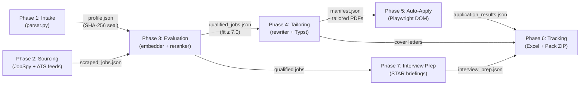

# Autonomous AI Job Search & Application Agent — Complete Architecture Reference

> **Version**: 0.3.0 · **Last verified**: 2026-09-22 · **Tests**: 500 passed, 6 skipped (506 total) · **Phases**: 7

This document is the **single source of truth** for any AI agent (Claude, Codex, Gemini, etc.) or developer working on this codebase. It maps every file, class, function, constant, data flow, and design invariant so you can make changes without reading all 60+ source files.

---

## Table of Contents

1. [Project Overview](#1-project-overview)
2. [Directory Tree](#2-directory-tree)
3. [Data Flow & Pipeline Architecture](#3-data-flow--pipeline-architecture)
4. [Anti-Hallucination Safety System](#4-anti-hallucination-safety-system)
5. [Configuration & Settings](#5-configuration--settings)
6. [Pydantic Schema Reference](#6-pydantic-schema-reference)
7. [Phase 1 — Intake & Readiness](#7-phase-1--intake--readiness)
8. [Phase 2 — Sourcing & Dedup](#8-phase-2--sourcing--dedup)
9. [Phase 3 — Evaluation & Scoring](#9-phase-3--evaluation--scoring)
10. [Phase 4 — Tailoring & Cover Letters](#10-phase-4--tailoring--cover-letters)
11. [Phase 5 — Auto-Apply & Workday Assist](#11-phase-5--auto-apply--workday-assist)
12. [Phase 6 — Tracking, Contacts & Bundles](#12-phase-6--tracking-contacts--bundles)
13. [Phase 7 — Interview Prep & STAR Briefings](#13-phase-7--interview-prep--star-briefings)
14. [Web UI (Visual Flow Console)](#14-web-ui-visual-flow-console)
15. [CLI Reference (26 Subcommands)](#15-cli-reference-26-subcommands)
16. [Environment Variables](#16-environment-variables)
17. [Dependencies](#17-dependencies)
18. [Test Suite (506 Tests)](#18-test-suite-506-tests)
19. [Key Design Invariants](#19-key-design-invariants)

---

## 1. Project Overview

A **local, seven-stage job hunting and application pipeline** that converts a candidate resume into sealed, fact-locked data, sources live jobs across job boards and direct ATS feeds, scores fit using dense embeddings and an LLM judge, tailors resumes with cryptographic anti-hallucination gates, auto-applies or prepares fallbacks, tracks outcomes with contact discovery and IMAP sync, and synthesizes role-specific interview preparation briefings.

**Core rule**: No stage may assert a fact about the candidate that is not in their resume.

```
Resume PDF → profile.json → scraped_jobs.json → qualified_jobs.json → tailored PDFs → application_results.json → tracker.xlsx & application_pack.zip → interview_prep.json
```

---

## 2. Directory Tree

```
c:\Users\Nithya\Desktop\job agent\
├── main.py                          # Thin entrypoint, adds src/ to sys.path, delegates to cli
├── pyproject.toml                   # Package config, dependencies, pytest configuration
├── requirements.txt                 # Flat dependency list
├── .env.example                     # Environment variables with defaults
├── .gitignore                       # Protects secrets, candidate resumes, outputs
├── README.md                        # Primary user documentation
├── START_HERE.md                    # Quickstart guide
├── ROADMAP_IMPLEMENTATION.md        # Feature roadmap & prompt recipes
├── ARCHITECTURE.md                  # Comprehensive architecture blueprint & AI reference
│
├── config/
│   └── searches.yaml                # Search parameters (domains, boards, locations, ATS targets)
│
├── templates/
│   ├── resume.typ                   # Typst template for single-column ATS resume compilation
│   └── cover_letter.typ             # Typst template for single-page grounded cover letters
│
├── data/                            # Runtime data (gitignored except sample resume)
│   ├── raw_resumes/                 # User resume drop folder
│   │   ├── sample_resume.pdf        # Bundled demo resume fixture
│   │   └── Raj_Aryan_APM_FatakPay.pdf # Current candidate resume
│   ├── profiles/
│   │   └── profile.json             # Sealed candidate profile with SHA-256 fact seal
│   ├── outputs/
│   │   ├── scraped_jobs.json        # Phase 2: Sourced job postings
│   │   ├── evaluated_jobs.json      # Phase 3: All scored jobs
│   │   ├── qualified_jobs.json      # Phase 3: Qualified shortlist (fit >= threshold)
│   │   ├── manifest.json            # Phase 4: Tailoring audit & metric restoration log
│   │   ├── tailored_resumes/        # Phase 4: ATS PDF resumes and cover letters
│   │   ├── application_results.json # Phase 5: Browser automation & fallback routing results
│   │   ├── applications_tracker.xlsx# Phase 6: Master Excel tracking workbook
│   │   ├── application_pack.zip     # Phase 6: Portable offline review bundle with HTML index
│   │   ├── interview_prep.json      # Phase 7: Role briefings, STAR evidence & practice questions
│   │   ├── delta_store.db           # SQLite persistent deduplication store
│   │   └── jobs.db                  # Relational job search cache
│   └── browser_profile/             # Persistent Chromium session (cookies, logins)
│
├── src/
│   └── job_agent/                   # Core package
│       ├── __init__.py              # __version__ = "0.3.0"
│       ├── __main__.py              # python -m job_agent support
│       ├── cli.py                   # 26 Click subcommands with lazy imports
│       ├── workflow.py              # Shared seven-phase pipeline execution engine
│       │
│       ├── config/                  # Configuration & normalization
│       │   ├── __init__.py
│       │   ├── normalize.py         # NFKC Unicode, date interval merging, E.164 phones, sanitizers
│       │   ├── schema.py            # 17+ StrictModel Pydantic models with field & model validators
│       │   └── settings.py          # pydantic-settings loader with provider selection & privacy defaults
│       │
│       ├── intake/                  # Phase 1: Intake & Readiness
│       │   ├── __init__.py
│       │   ├── cli.py               # Interactive YAML search configuration
│       │   ├── heuristic.py         # Deterministic regex parser (zero LLM dependency)
│       │   ├── layout.py            # PDF column detection & reading-order reconstruction
│       │   ├── parser.py            # Extraction ladder: LlamaParse → pdfplumber → pypdf → LLM → heuristic
│       │   ├── readiness.py         # Non-destructive pre-flight diagnostic (0-100 score)
│       │   └── validator.py         # Metric extraction, source audit, SHA-256 fact sealing
│       │
│       ├── sourcing/                # Phase 2: Sourcing & Dedup
│       │   ├── __init__.py
│       │   ├── scraper.py           # OmnichannelScraper (JobSpy + sticky proxies + filters)
│       │   ├── ats_direct.py        # Greenhouse, Lever, Ashby public API ingestion
│       │   ├── delta_store.py       # SQLite WAL-mode lifetime status tracking
│       │   ├── proxy_manager.py     # Sticky residential proxy rotation
│       │   └── public_feeds.py      # Aggregated public job feeds & token extractors
│       │
│       ├── evaluation/              # Phase 3: Evaluation & Scoring
│       │   ├── __init__.py
│       │   ├── embedder.py          # Dense vector similarity (sentence-transformers / TF-IDF)
│       │   ├── reranker.py          # LLM judge (Groq/OpenAI/Anthropic + heuristic fallback)
│       │   └── pipeline.py          # Two-tier pipeline coordinator with atomic checkpoints
│       │
│       ├── tailoring/               # Phase 4: Tailoring & Cover Letters
│       │   ├── __init__.py
│       │   ├── compiler.py          # Typst compiler (<100ms ATS PDFs)
│       │   ├── cover_letter.py      # Grounded cover letter generator
│       │   ├── pipeline.py          # Tailoring pipeline coordinator
│       │   ├── regional.py          # Regional formatting & remote eligibility rules
│       │   └── rewriter.py          # Bullet rewriter with metric restoration & fabrication gate
│       │
│       ├── automation/              # Phase 5: Browser Auto-Apply & Assist
│       │   ├── __init__.py
│       │   ├── agent.py             # Step-bounded execution loop (max 25 steps)
│       │   ├── browser_session.py   # Persistent Chromium context with stealth evasions
│       │   ├── form_filler.py       # Fact-grounded DOM form filler
│       │   ├── hitl.py              # Human-in-the-loop CAPTCHA/MFA pause
│       │   ├── navigator.py         # DOM perception & action button scanner
│       │   ├── pipeline.py          # Auto-apply coordinator with live confirmation gate
│       │   └── workday.py           # Assistive filling for Workday career portals
│       │
│       ├── tracking/                # Phase 6: Tracking, Contacts & Bundles
│       │   ├── __init__.py
│       │   ├── bundle.py            # Portable application pack ZIP builder & validator
│       │   ├── cold_email.py        # Fact-grounded cold outreach email synthesizer
│       │   ├── contacts.py          # Warm contact discovery & email pattern generator
│       │   ├── export.py            # Master CSV and portable exports
│       │   ├── inbox.py             # IMAP reply sync & outcome status updater
│       │   ├── pipeline.py          # Fallback tracking pipeline coordinator
│       │   ├── quality.py           # Readiness & data quality assessment (score / 10)
│       │   ├── styler.py            # openpyxl workbook styling with score-based priority fills
│       │   └── tracker.py           # Idempotent Excel tracker with hidden Job ID index
│       │
│       ├── prep/                    # Phase 7: Interview Prep & STAR Briefings
│       │   ├── __init__.py
│       │   └── pipeline.py          # Role briefing, STAR evidence mapping & practice prompts
│       │
│       ├── hosted/                  # Self-Hosted Control Plane
│       │   ├── __init__.py
│       │   ├── auth.py              # Bearer token authentication & key generation
│       │   ├── db.py                # PostgreSQL / SQLite queue database
│       │   └── worker.py            # Background job consumer
│       │
│       └── web/                     # Visual Flow Console
│           ├── __init__.py
│           ├── runner.py            # Background PipelineRunner with line-tee SSE streaming
│           ├── server.py            # Python stdlib HTTP server with CSRF & DNS-rebinding guards
│           ├── state.py             # Stateless disk-backed snapshot builder for all 7 phases
│           └── static/
│               ├── index.html       # Single-page dashboard shell
│               ├── styles.css       # Dark/light responsive CSS & node-graph layout
│               └── app.js           # Vanilla JS controller: graph, wizard, SSE, inspector
│
└── tests/                           # 34 test files, 506 tests (500 passed, 6 skipped)
```

---

## 3. Data Flow & Pipeline Architecture



### Artifact Chain

| Phase | Reads | Writes |
|:---|:---|:---|
| 1. Intake | `data/raw_resumes/*.pdf` | `data/profiles/profile.json` |
| 2. Sourcing | `config/searches.yaml` | `data/outputs/scraped_jobs.json`, `delta_store.db` |
| 3. Evaluation | `profile.json`, `scraped_jobs.json` | `evaluated_jobs.json`, `qualified_jobs.json` |
| 4. Tailoring | `profile.json`, `qualified_jobs.json` | `manifest.json`, `tailored_resumes/*.pdf` |
| 5. Auto-Apply | `profile.json`, `manifest.json` | `application_results.json` |
| 6. Tracking | `application_results.json`, `qualified_jobs.json` | `applications_tracker.xlsx`, `application_pack.zip` |
| 7. Interview Prep | `profile.json`, `qualified_jobs.json` | `data/outputs/interview_prep.json` |

---

## 4. Anti-Hallucination Safety System

Four cryptographic and algorithmic gates ensure zero fact mutation:

1. **Gate 1 — Intake (`validator.py`)**: Quantifiable achievements are isolated by regex, audited against the raw resume string, and hashed into an order-independent SHA-256 seal (`CandidateProfile.fact_hash`).
2. **Gate 2 — Tailoring (`rewriter.py`)**:
   - *Restoration*: Dropped locked metrics are automatically reinstated.
   - *Fabrication Gate*: Bullets with unverified numbers revert to the closest original bullet or are dropped.
3. **Gate 3 — Form Filling (`form_filler.py`)**: Fields without a backing candidate fact are left blank and reported in `skipped_fields`. No automated guessing or speculative answers.
4. **Gate 4 — Verification (`python main.py verify`)**: Phases 4, 5, 6, and 7 verify the SHA-256 seal before execution; tampered profiles are rejected immediately.

---

## 5. Configuration & Settings

`settings.py` provides typed configuration via `pydantic-settings`:
- **Auto-directory provisioning**: `settings.ensure_directories()` initializes all data and output folders on import.
- **Provider selection**: Automatically selects Groq, OpenAI, or Anthropic based on configured keys, defaulting gracefully to deterministic heuristic fallbacks if no keys are provided.
- **Privacy enforcement**: Forces `ANONYMIZED_TELEMETRY="false"` and `POSTHOG_DISABLED="1"` in `os.environ` to block telemetry leaks.

---

## 6. Pydantic Schema Reference

Key models in `schema.py` (all inherit from `StrictModel` with `extra="forbid"`):
- `CandidateProfile`: Complete candidate profile, contact info, employment, skills, projects, and SHA-256 seal.
- `JobPosting`: Normalized posting containing title, company, location, URL, description, salary bands, work mode, and contacts.
- `EvaluationScore`: Tier 1 embedding similarity, Tier 2 fit score, technical and seniority breakdown, reasoning, and skill overlap.
- `EvaluatedJob`: Composition of `job: JobPosting` and `evaluation: EvaluationScore`.
- `TailoredResumeRecord`: Audit record documenting tailored PDF path, fit score, restored metrics, and blocked fabrications.
- `ApplicationOutcome`: Result of browser form automation or fallback routing.

---

## 7. Phase 1 — Intake & Readiness
- `parser.py`: Multi-strategy extraction ladder (LlamaParse → pdfplumber → pypdf → LLM → deterministic heuristic).
- `heuristic.py`: 1007-line deterministic parser using regex to extract contact info, experience, education, and categorized skills with zero AI cost.
- `readiness.py`: Pre-flight diagnostic score (0-100) reporting blockers (-25) and warnings (-7) without side effects.
- `validator.py`: Enriches metrics (including Indian denominations ₹ crore/lakh), audits against source text, and seals with SHA-256.

---

## 8. Phase 2 — Sourcing & Dedup
- `scraper.py`: Omnichannel scraper using `python-jobspy` across LinkedIn, Indeed, Glassdoor, ZipRecruiter, Google Jobs, Bayt, Naukri, and BDJobs.
- `ats_direct.py`: Direct public API feeds from Greenhouse, Lever, and Ashby boards, bypassing search aggregator rate limits.
- `delta_store.py`: Persistent SQLite store in WAL mode ensuring each job is evaluated, tailored, and applied to exactly once.
- `proxy_manager.py`: Sticky residential proxy rotation per board with automatic failure handling.

---

## 9. Phase 3 — Evaluation & Scoring
- **Tier 1**: `embedder.py` runs fast, free cosine similarity filtering using `sentence-transformers/all-MiniLM-L6-v2` (or TF-IDF fallback).
- **Tier 2**: `reranker.py` scores candidates 1.0–10.0 using Groq (`openai/gpt-oss-120b`), OpenAI (`gpt-4o`), Anthropic, or an offline heuristic judge.
- **Atomic Checkpointing**: Saves progress to `evaluation_checkpoint.json` so interrupted runs resume seamlessly without re-scoring previously evaluated jobs.

---

## 10. Phase 4 — Tailoring & Cover Letters
- `rewriter.py`: Role-specific bullet point tailoring with strict metric integrity enforcement.
- `compiler.py`: Typst Rust-backed compiler generating single-column ATS-friendly PDFs in ~100ms.
- `cover_letter.py`: Generates matching grounded one-page cover letters compiled via `cover_letter.typ`.
- `regional.py`: Applies country-specific formatting (US, UK, India, Canada, Germany) and evaluates remote work authorization.

---

## 11. Phase 5 — Auto-Apply & Workday Assist
- `agent.py`: Step-bounded browser automation loop (capped at 25 steps, max 3 consecutive errors).
- `browser_session.py`: Persistent Chromium user profile preserving cookies and session logins across runs.
- `form_filler.py`: DOM perception and factual question answering. Unknown questions are skipped, never guessed.
- `hitl.py`: Human-in-the-loop pause for CAPTCHA and MFA challenges.
- `workday.py`: Specialized assistant for complex Workday multi-page application flows.

---

## 12. Phase 6 — Tracking, Contacts & Bundles
- `tracker.py`: `applications_tracker.xlsx` master workbook with navy headers, priority color fills, and idempotent rows via hidden Job ID column.
- `contacts.py`: Discovers published hiring team members and generates corporate email patterns (`first.last@company.com`).
- `inbox.py`: Connects via IMAP to read application updates and synchronize interview invitations or rejections into tracking records.
- `bundle.py`: Assembles `application_pack.zip` containing an interactive HTML dashboard, verified PDFs, CSV exports, and SHA-256 hash manifest.
- `quality.py`: Computes an end-to-end quality score out of 10 for profile integrity, freshness, document coverage, and tracking readiness.

---

## 13. Phase 7 — Interview Prep & STAR Briefings
- `prep/pipeline.py`: Generates tailored interview preparation packets for each qualified role.
- **STAR Evidence Mapping**: Aligns verified resume achievements with target job requirements.
- **Role Briefings**: Synthesizes company mission, tech stack highlights, and practice interview questions.
- **Offline Fallback**: Fully functional without external API keys.

---

## 14. Web UI (Visual Flow Console)
- **Zero-framework architecture**: Standard library `http.server.ThreadingHTTPServer`.
- **Security controls**: Loopback-only binding (`127.0.0.1`), Windows `SO_EXCLUSIVEADDRUSE`, per-session CSRF tokens, Host/Origin DNS-rebinding protection, and explicit `"confirm_live": "APPLY"` verification.
- **Live progress streaming**: Real-time Server-Sent Events (SSE) via `_LineTee` pipe.
- **Interactive UI**: n8n-style node graph across all 7 phases, first-run resume wizard, live log viewer, and settings manager.

---

## 15. CLI Reference (26 Subcommands)

```powershell
# Core Lifecycle
python main.py intake [--resume FILE]          # Phase 1: Parse & seal profile
python main.py check [RESUME]                  # Phase 1: Pre-flight readiness diagnostic
python main.py configure                      # Phase 1: Interactive search parameters
python main.py verify                         # Phase 1: Check SHA-256 fact seal
python main.py source [--no-ats]              # Phase 2: Omnichannel job scraping
python main.py evaluate [--threshold T]        # Phase 3: Two-tier semantic evaluation
python main.py tailor [--cover-letter]         # Phase 4: ATS PDF tailoring & cover letters
python main.py apply [--dry-run]              # Phase 5: Browser automation execution
python main.py track [--all]                   # Phase 6: Excel tracker & cold outreach
python main.py prep [--offline]                # Phase 7: Interview prep & STAR evidence
python main.py run-pipeline [--dry-run]        # Phases 1-7 end-to-end execution
python main.py daily [--limit N]              # Daily search-to-download pack workflow

# Specialized Tools & Operations
python main.py ui [--port 8765]                # Launch Web Visual Flow Console
python main.py quality                         # Score system data & document quality (/10)
python main.py export [--bundle]               # Export CSV or portable application pack ZIP
python main.py contacts [--limit N]            # Discover team leads & hiring contacts
python main.py preferences                     # Set work modes & country preferences
python main.py sync-inbox                      # Read IMAP folder for application outcomes
python main.py workday-assist                  # Assistive browser fill for Workday portals
python main.py db [QUERY]                      # Query relational jobs cache
python main.py db-check                        # Verify hosted queue database
python main.py hosted-key                      # Generate/inspect hosted control plane tokens
python main.py production-check               # Self-hosted production deployment audit
python main.py doctor [--live]                 # Check dependencies, keys & browser
python main.py status                          # Full pipeline state summary
python main.py reset [--delta] [--outputs]     # Clear delta store or generated artifacts
```

---

## 16. Environment Variables

Configured via `.env` file (see `.env.example`):
- `DEFAULT_LLM_PROVIDER`: `groq`, `openai`, `anthropic`, or `none`.
- `GROQ_API_KEY`: Groq cloud API key.
- `OPENAI_API_KEY`, `ANTHROPIC_API_KEY`, `LLAMA_CLOUD_API_KEY`: Optional provider keys.
- `SEMANTIC_EMBEDDING_MODEL`: `sentence-transformers/all-MiniLM-L6-v2`.
- `TIER1_THRESHOLD`: Cosine similarity cutoff (default `0.15`).
- `MIN_MATCH_SCORE`: LLM judge cutoff (default `7.0`).
- `PLAYWRIGHT_HEADLESS`: Run browser headlessly (`false` for visible debugging).
- `MAX_APPLICATION_STEPS`: Hard ceiling per application (default `25`).
- `REQUIRE_APPLY_CONFIRMATION`: Require explicit confirmation before live apply (`true`).
- `ANONYMIZED_TELEMETRY`: Forced to `false` across all libraries for candidate privacy.

---

## 17. Test Suite (506 Tests)

Run with `python -m pytest -v`:
- **Current status**: 500 passed, 6 skipped (browser integration tests opt-in via `JOB_AGENT_BROWSER_TESTS=1`).
- **Test execution time**: ~2.5 minutes across 34 test modules.
- **Key test modules**:
  - `test_anti_hallucination.py`: Fact sealing, intake audit, tailoring gate, cold email verification.
  - `test_application_pack.py`: Portable ZIP bundle generation and document hash validation.
  - `test_workflow.py`: Seven-phase workflow coordinator and daily command runner.
  - `test_web.py`: HTTP security headers, CSRF token validation, loopback origin checks, SSE streaming.
  - `test_readiness.py`: Resume format diagnostics, scoring penalties, actionable recommendations.
  - `test_tailoring.py`: Typst compilation, metric preservation, and fabrication blocking.

---

## 18. Key Design Invariants

> [!IMPORTANT]
> These invariants are strictly enforced by automated tests across the codebase:

1. **Zero Fact Invention**: Every candidate statement must be copied from the resume or arithmetically derived.
2. **Cryptographic Fact Seal**: Locked achievements are hashed via SHA-256; tampered profiles halt execution.
3. **Derived Qualification**: `passed_threshold` is always derived programmatically from `fit_score >= threshold_used`, never delegated to LLMs.
4. **Derived Application Status**: `applied` is strictly derived from `status == "applied"`, preventing dry runs from contaminating records.
5. **Single Submit Attempt**: Browser automation clicks submit at most once per job to prevent duplicate applications.
6. **Deterministic Offline Fallbacks**: Every phase functions completely without paid API keys.
7. **Semicolon Metric Separation**: Metric values use `"; "` delimiters to prevent thousand-separators from breaking.
8. **Idempotent Bookkeeping**: Relational and Excel trackers use job IDs to update existing rows rather than creating duplicate entries.
9. **Exclusive Process Lock**: CLI and UI pipeline runs enforce exclusive locks to prevent corrupting disk artifacts.
10. **Loopback & Privacy**: Web UI binds only to loopback; all external telemetry is unconditionally disabled.
