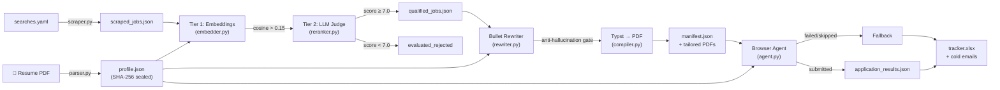

# Autonomous AI Job Search & Application Agent — Complete Architecture Reference

> **Version**: 0.2.0 · **Last verified**: 2026-09-16 · **Tests**: 196/196 pass · **Files**: 70

This document is the **single source of truth** for any AI agent (Claude, Codex, Gemini, etc.) or developer working on this codebase. It maps every file, class, function, constant, data flow, and design invariant so you can make changes without reading all 50+ source files.

---

## Table of Contents

1. [Project Overview](#1-project-overview)
2. [Directory Tree](#2-directory-tree)
3. [Data Flow & Pipeline Architecture](#3-data-flow--pipeline-architecture)
4. [Anti-Hallucination Safety System](#4-anti-hallucination-safety-system)
5. [Configuration & Settings](#5-configuration--settings)
6. [Pydantic Schema Reference](#6-pydantic-schema-reference)
7. [Phase 1 — Intake](#7-phase-1--intake)
8. [Phase 2 — Sourcing](#8-phase-2--sourcing)
9. [Phase 3 — Evaluation](#9-phase-3--evaluation)
10. [Phase 4 — Tailoring](#10-phase-4--tailoring)
11. [Phase 5 — Auto-Apply](#11-phase-5--auto-apply)
12. [Phase 6 — Tracking](#12-phase-6--tracking)
13. [Web UI (Flow Console)](#13-web-ui-flow-console)
14. [CLI Reference](#14-cli-reference)
15. [Environment Variables](#15-environment-variables)
16. [Dependencies](#16-dependencies)
17. [Test Suite](#17-test-suite)
18. [Key Design Invariants](#18-key-design-invariants)

---

## 1. Project Overview

A **local, six-stage job hunting pipeline** that converts a resume PDF into sealed candidate data, scrapes job boards, evaluates fit via embeddings + LLM, tailors resumes with anti-hallucination gates, auto-applies via browser automation, and tracks outcomes in a styled Excel workbook.

**Core rule**: No stage may assert a fact about the candidate that is not in their resume.

```
Resume PDF → profile.json → scraped_jobs.json → qualified_jobs.json → tailored PDFs → applications → tracker.xlsx
```

---

## 2. Directory Tree

```
c:\Users\Nithya\Desktop\job agent\
├── main.py                          # 28 lines — Thin entrypoint, adds src/ to path, delegates to cli
├── pyproject.toml                   # 66 lines — Package config, deps, pytest settings
├── requirements.txt                 # 51 lines — Flat dependency list
├── .env.example                     # 55 lines — All env vars with defaults
├── .gitignore                       # 35 lines — Protects .env, candidate PDFs, outputs
├── README.md                        # 384 lines — Full documentation
├── ARCHITECTURE.md                  # Comprehensive architecture blueprint & AI reference
│
├── config/
│   └── searches.yaml                # 21 lines — Job search parameters (domains, boards, locations)
│
├── templates/
│   └── resume.typ                   # 134 lines — Typst template for ATS PDF compilation
│
├── data/                            # Runtime data (gitignored except sample)
│   ├── raw_resumes/
│   │   └── sample_resume.pdf        # Bundled demo resume for "Alex Rivera"
│   ├── profiles/
│   │   └── profile.json             # Sealed candidate profile (generated)
│   ├── outputs/
│   │   ├── scraped_jobs.json        # Phase 2 output
│   │   ├── evaluated_jobs.json      # Phase 3 output (all scored)
│   │   ├── qualified_jobs.json      # Phase 3 output (passed threshold)
│   │   ├── manifest.json            # Phase 4 output (tailoring audit)
│   │   ├── tailored_resumes/        # Phase 4 PDFs
│   │   ├── application_results.json # Phase 5 output
│   │   ├── applications_tracker.xlsx# Phase 6 output
│   │   └── delta_store.db           # SQLite seen-jobs dedup store
│   └── browser_profile/             # Persistent Chromium session
│
├── src/
│   └── job_agent/                   # Main package
│       ├── __init__.py              # 5 lines — __version__ = "0.2.0"
│       ├── __main__.py              # 8 lines — python -m job_agent support
│       ├── cli.py                   # 711 lines — 14 Click subcommands
│       │
│       ├── config/                  # Configuration & schemas
│       │   ├── __init__.py          # 3 lines
│       │   ├── normalize.py         # 376 lines — Text cleaning, date parsing, URL/phone normalization
│       │   ├── schema.py            # 1003 lines — 17 Pydantic models, all validators
│       │   └── settings.py          # 184 lines — pydantic-settings env loader, path resolver
│       │
│       ├── intake/                  # Phase 1: Resume parsing
│       │   ├── __init__.py          # 3 lines
│       │   ├── cli.py               # 173 lines — Interactive search config prompts
│       │   ├── heuristic.py         # 1007 lines — Deterministic resume parser (zero LLM)
│       │   ├── layout.py            # 199 lines — PDF column detection & reading order
│       │   ├── parser.py            # 412 lines — Multi-strategy extractor (LlamaParse→pdfplumber→LLM→heuristic)
│       │   ├── readiness.py         # 299 lines — Resume diagnostic (check command)
│       │   └── validator.py         # 323 lines — Metric extraction, fact-checking, SHA-256 sealing
│       │
│       ├── sourcing/                # Phase 2: Job scraping
│       │   ├── __init__.py          # 3 lines
│       │   ├── scraper.py           # 345 lines — OmnichannelScraper (JobSpy + proxy + filters)
│       │   ├── ats_direct.py        # 298 lines — Greenhouse/Lever/Ashby direct API feeds
│       │   ├── delta_store.py       # 166 lines — SQLite dedup store (WAL mode)
│       │   └── proxy_manager.py     # 103 lines — Sticky residential proxy rotation
│       │
│       ├── evaluation/              # Phase 3: Two-tier scoring
│       │   ├── __init__.py          # 3 lines
│       │   ├── embedder.py          # 138 lines — Dense vector similarity (sentence-transformers / TF-IDF fallback)
│       │   ├── pipeline.py          # 199 lines — SemanticEvaluationPipeline orchestrator
│       │   └── reranker.py          # 369 lines — LLM judge (OpenAI/Anthropic/heuristic fallback)
│       │
│       ├── tailoring/               # Phase 4: Resume rewriting
│       │   ├── __init__.py          # 3 lines
│       │   ├── rewriter.py          # 404 lines — LLM bullet rewriter + anti-hallucination gate
│       │   ├── compiler.py          # 82 lines — Typst PDF compiler (~100ms)
│       │   └── pipeline.py          # 175 lines — ResumeTailoringPipeline orchestrator
│       │
│       ├── automation/              # Phase 5: Browser auto-apply
│       │   ├── __init__.py          # 3 lines
│       │   ├── agent.py             # 224 lines — AutoApplyAgent (step-bounded loop)
│       │   ├── browser_session.py   # 145 lines — Playwright stealth session manager
│       │   ├── form_filler.py       # 262 lines — DOM form filling (fact-grounded)
│       │   ├── hitl.py              # 124 lines — CAPTCHA/MFA human-in-the-loop pause
│       │   ├── navigator.py         # 169 lines — DOM page navigator & form scanner
│       │   └── pipeline.py          # 226 lines — AutoApplyPipeline orchestrator
│       │
│       ├── tracking/                # Phase 6: Excel tracking
│       │   ├── __init__.py          # 3 lines
│       │   ├── cold_email.py        # 172 lines — Cold outreach email generator
│       │   ├── pipeline.py          # 265 lines — FallbackTrackingPipeline orchestrator
│       │   ├── styler.py            # 79 lines — Excel styling (priority fills, borders)
│       │   └── tracker.py           # 195 lines — MasterTracker Excel writer (idempotent rows)
│       │
│       └── web/                     # Visual flow console (stdlib HTTP, zero frameworks)
│           ├── __init__.py          # 11 lines
│           ├── server.py            # 466 lines — HTTP server with CSRF, DNS-rebinding protection
│           ├── runner.py            # 384 lines — Background pipeline executor with SSE streaming
│           ├── state.py             # 391 lines — Disk-based state snapshot builder
│           └── static/
│               ├── index.html       # 80 lines — SPA shell
│               ├── styles.css       # 503 lines — Dark/light themes, node graph styles
│               └── app.js           # 1361 lines — Vanilla JS: graph, SSE, wizard, settings
│
└── tests/                           # 15 files, 196 tests
    ├── __init__.py                  # 3 lines
    ├── generate_test_resume.py      # 126 lines — ReportLab test PDF generator
    ├── test_anti_hallucination.py   # 292 lines — 11 tests
    ├── test_automation.py           # 158 lines — 5 tests
    ├── test_evaluation.py           # 180 lines — 5 tests
    ├── test_intake.py               # 75 lines — 3 tests
    ├── test_normalize.py            # 173 lines — 15 tests
    ├── test_readiness.py            # 201 lines — 14 tests
    ├── test_resume_layouts.py       # 284 lines — 18 tests
    ├── test_schema.py               # 171 lines — 6 tests
    ├── test_sourcing.py             # 224 lines — 11 tests
    ├── test_tailoring.py            # 192 lines — 3 tests
    ├── test_tracking.py             # 170 lines — 3 tests
    ├── test_validation.py           # 264 lines — 21 tests
    └── test_web.py                  # 560 lines — 25 tests
```

**Total source lines**: ~11,000 (Python) + ~1,940 (JS/CSS/HTML) + ~134 (Typst)

---

## 3. Data Flow & Pipeline Architecture



### Artifact Chain

| Phase | Reads | Writes |
|:---|:---|:---|
| 1. Intake | `data/raw_resumes/*.pdf` | `data/profiles/profile.json` |
| 2. Sourcing | `config/searches.yaml` | `data/outputs/scraped_jobs.json`, `delta_store.db` |
| 3. Evaluation | `profile.json`, `scraped_jobs.json` | `evaluated_jobs.json`, `qualified_jobs.json` |
| 4. Tailoring | `profile.json`, `qualified_jobs.json` | `manifest.json`, `tailored_resumes/*.pdf` |
| 5. Auto-Apply | `profile.json`, `manifest.json` | `application_results.json` |
| 6. Tracking | `application_results.json`, `qualified_jobs.json` | `applications_tracker.xlsx` |

---

## 4. Anti-Hallucination Safety System

Three gates enforce the rule: **no stage may assert a fact not in the resume**.

### Gate 1 — Intake (`validator.py`)
- `extract_potential_metrics(text)` → finds all numbers/metrics in resume text
- `enrich_locked_facts(profile_data)` → wraps metrics as `LockedFact` entries
- `audit_metrics_against_source(profile_data, source_text)` → removes any metric not found in raw text
- Profile sealed with `SHA-256` hash via `CandidateProfile.compute_fact_hash()`

### Gate 2 — Tailoring (`rewriter.py`)
- `enforce_metric_integrity(profile, tailored_data)` returns `(cleaned_data, restored, dropped)`
- **Restoration**: Locked metrics the LLM dropped are reinstated
- **Fabrication gate**: Bullets with numbers not in the sealed profile revert to the closest original bullet

### Gate 3 — Form Filling (`form_filler.py`)
- Fields with no backing fact are left blank and logged to `skipped_fields`
- No guessing, no placeholders, no automatic "Yes" on screening questions

### Verification
- `python main.py verify` — checks SHA-256 hash over locked facts
- Phases 4 and 5 refuse to run against a tampered profile

---

## 5. Configuration & Settings

### `settings.py` — `Settings(BaseSettings)`
| Field | Type | Default/Source | Purpose |
|:---|:---|:---|:---|
| `default_llm_provider` | `str` | `"openai"` | LLM provider selection |
| `openai_api_key` | `Optional[str]` | `.env` | OpenAI API key |
| `anthropic_api_key` | `Optional[str]` | `.env` | Anthropic API key |
| `llama_cloud_api_key` | `Optional[str]` | `.env` | LlamaParse API key |
| `llm_intake_model` | `str` | `"gpt-4o"` | Model for resume extraction |
| `llm_rerank_model` | `str` | `"gpt-4o"` | Model for job scoring |
| `llm_tailor_model` | `str` | `"gpt-4o"` | Model for bullet rewriting |
| `anthropic_model` | `str` | `"claude-sonnet-5"` | Anthropic model name |
| `semantic_embedding_model` | `str` | `"all-MiniLM-L6-v2"` | Sentence-transformers model |
| `tier1_threshold` | `float` | `0.15` | Embedding similarity cutoff |
| `min_match_score` | `float` | `7.0` | LLM judge qualification threshold |
| `residential_proxy_url` | `Optional[str]` | `.env` | Proxy for scraping |
| `playwright_headless` | `bool` | `False` | Browser visibility |
| `playwright_wait_strategy` | `str` | `"networkidle"` | Page load strategy |
| `max_application_steps` | `int` | `25` | Step ceiling per job |
| `require_apply_confirmation` | `bool` | `True` | Prompt before live apply |
| `use_vision` | `bool` | `False` | DOM-only perception |
| `capsolver_api_key` | `Optional[str]` | `.env` | CAPTCHA solver (stubbed) |

**Key property**: `active_provider` → returns `"openai"`, `"anthropic"`, or `"none"` based on which key is actually configured.

**Path resolution**: `BASE_DIR = Path(__file__).resolve().parents[3]` → project root. All paths derived from this.

**Startup behavior**: `settings.ensure_directories()` runs automatically on import, creating `data/`, `data/outputs/`, `data/profiles/`, `data/raw_resumes/`.

---

## 6. Pydantic Schema Reference

All models in `schema.py` (1003 lines) inherit from `StrictModel(BaseModel)` with `extra="forbid"`.

| Model | Purpose | Key Fields |
|:---|:---|:---|
| `ContactInfo` | Personal details | `full_name`, `email`, `phone`, `location`, `linkedin_url`, `github_url`, `portfolio_url` |
| `WorkAuthorization` | Visa/citizenship | `current_country`, `citizenship[]`, `authorized_countries[]`, `requires_sponsorship`, `visa_status` |
| `Education` | Degree entries | `institution`, `degree`, `field_of_study`, `start_date`, `end_date`, `gpa`, `honors[]` |
| `LockedFact` | Immutable metric | `statement`, `metric_value`, `category` (Literal: metric/deployment/scale/revenue/tenure/award) |
| `WorkExperience` | Employment entry | `company`, `title`, `start_date`, `end_date`, `is_current`, `location`, `description_bullets[]`, `locked_facts[]` |
| `Project` | Personal project | `title`, `role`, `description`, `technologies[]`, `link`, `locked_facts[]` |
| `SkillSet` | 5-category skills | `languages[]`, `frameworks[]`, `developer_tools[]`, `cloud_devops[]`, `domain_knowledge[]` |
| `Certification` | Credentials | `name`, `issuer`, `issue_date`, `credential_url` |
| `CandidateProfile` | **Master profile** | `contact`, `summary`, `years_of_experience`, `work_authorization`, `experience[]`, `education[]`, `skills`, `projects[]`, `certifications[]`, `fact_hash`, `source_document`, `last_updated` |
| `SearchParameters` | Job search config | `target_domains[]`, `locations[]`, `is_remote`, `hours_old`, `job_boards[]`, `country_indeed`, `min_salary`, `max_results_per_board`, `ats_companies{}`, `proxy_url` |
| `JobPosting` | Scraped job | `id`, `title`, `company`, `location`, `job_url`, `description`, `source`, `is_remote`, `salary_min`, `salary_max`, `date_posted` |
| `RerankerVerdict` | LLM judge output | `fit_score`, `technical_score`, `seniority_score`, `reasoning`, `matching_skills[]`, `missing_skills[]` |
| `EvaluationScore` | Combined score | `embedding_similarity`, `fit_score`, `technical_score`, `seniority_score`, `passed_threshold`, `threshold_used` |
| `EvaluatedJob` | Job + score pair | `posting: JobPosting`, `score: EvaluationScore` |
| `TailoredResumeRecord` | Tailoring audit | `job_id`, `company`, `title`, `pdf_path`, `fit_score`, `metrics_restored`, `fabrications_blocked` |
| `ApplicationOutcome` | Apply result | `job_id`, `company`, `title`, `status`, `steps_taken`, `error`, `applied`, `pdf_used` |

### Critical Schema Invariants
- `LockedFact.metric_value` uses `"; "` as separator (not `,`) so `"15,000+ users"` doesn't split
- `EvaluationScore.passed_threshold` is **always derived** from `fit_score >= threshold_used` in `@model_validator`, never from LLM
- `ApplicationOutcome.applied` is **always derived** from `status == "applied"` in `@model_validator`
- `JobPosting.create_id()` generates deterministic 16-char hex from URL (sans query params) or company+title
- `CandidateProfile.compute_fact_hash()` → order-independent SHA-256 over all locked facts

---

## 7. Phase 1 — Intake

### Files & Classes

| File | Lines | Key Export |
|:---|:---|:---|
| `parser.py` | 412 | `ResumeParser` |
| `heuristic.py` | 1007 | `build_profile_dict()` |
| `layout.py` | 199 | `extract_page_lines()`, `find_column_split()` |
| `validator.py` | 323 | `validate_and_save_profile()`, `extract_potential_metrics()` |
| `readiness.py` | 299 | `check_resume()` → `ReadinessReport` |
| `cli.py` | 173 | `configure_cli()`, `load_search_parameters()` |

### `ResumeParser` — Extraction Ladder
1. **LlamaParse** (cloud, if key configured) → markdown
2. **pdfplumber** (local, column-aware via `layout.py`) → text
3. **pypdf** (fallback PDF reader) → text
4. **LLM extraction** (OpenAI/Anthropic) with `SYSTEM_EXTRACTION_PROMPT` → JSON, **fact-checked** against source text
5. **Deterministic heuristic** (`build_profile_dict()`) → JSON with zero LLM dependency

### `heuristic.py` — Deterministic Parser (1007 lines)
The largest file. Parses resumes using regex and heuristics with **zero AI**.

Key functions:
- `split_sections(text)` → `Dict[str, List[str]]` mapping canonical names to lines
- `extract_contact(header, text)` → name, email, phone, location, profiles
- `parse_experience(lines)` → `List[Dict]` handling inline, stacked, right-aligned layouts
- `parse_education(lines)` → degrees with institutions, GPAs, dates
- `parse_skills(lines)` → 5-category classification via `KNOWN_TECH` dictionary
- `build_profile_dict(text)` → complete profile dict ready for Pydantic validation

Key constants:
- `SECTION_ALIASES` — 11 canonical names, each with ~5-15 aliases
- `TITLE_KEYWORDS` — 39 job title words
- `COMPANY_KEYWORDS` — 29 corporate suffixes
- `KNOWN_TECH` — Dictionary mapping tech names → categories
- `US_STATE_CODES` — 51 entries, `CANADIAN_PROVINCES` — 13 entries
- `KNOWN_COUNTRIES` — Country name → standardized mapping

### `layout.py` — Column Detection
- `find_column_split(words, page_width)` → detects vertical gutter between columns
- `extract_page_lines(page)` → emits denser column first for correct reading order
- Thresholds: `MIN_GUTTER_WIDTH=14.0pt`, `MIN_COLUMN_SHARE=0.18`, `MAX_ROW_ALIGNMENT=0.8`

### `validator.py` — Fact Sealing Pipeline
1. `extract_potential_metrics(text)` → finds `$45M`, `99.9%`, `15,000+ users`, `₹45 crore`
2. `enrich_locked_facts(profile_data)` → wraps metrics as `LockedFact` entries
3. `audit_metrics_against_source(profile_data, source_text)` → removes unverified metrics
4. `validate_and_save_profile(data, path, source_text)` → seal with SHA-256, write to disk

Metric patterns include: currency amounts, percentages, multipliers, tenure, suffixed counts, explicit "N+" claims, plural counts. Indian denominations (crore/lakh) are supported.

### `readiness.py` — Diagnostic Without Side Effects
- `check_resume(path)` → `ReadinessReport` with score 0-100
- Blockers: -25 points each (name missing, email missing, zero experience, unreadable)
- Warnings: -7 points each (no skills, no summary, few metrics, two-column layout)
- Never writes to `profile.json`

---

## 8. Phase 2 — Sourcing

### Files & Classes

| File | Lines | Key Export |
|:---|:---|:---|
| `scraper.py` | 345 | `OmnichannelScraper` |
| `ats_direct.py` | 298 | `ATSDirectIngestion` |
| `delta_store.py` | 166 | `DeltaStore` |
| `proxy_manager.py` | 103 | `ProxyManager` |

### `OmnichannelScraper`
- `scrape_job_boards()` → iterates boards × domains × locations using `python-jobspy`
- `_scrape_single_board()` → 2 retries with proxy rotation on 429/403
- `_passes_filters(job)` → remote match, salary floor, freshness window
- `_deduplicate(jobs)` → by `job.id`, keeps longer description
- `run_sourcing_pipeline()` → full sweep: scrape → filter → dedup → delta store → save

### `ATSDirectIngestion`
- Direct API feeds: `fetch_greenhouse_jobs(token)`, `fetch_lever_jobs(token)`, `fetch_ashby_jobs(org)`
- `matches_domain(posting, domains)` → token overlap matching (threshold: 2+ tokens or `MIN_TOKEN_OVERLAP_RATIO=0.5`)
- `_STOPWORD_TOKENS` — 20 generic title words excluded from matching

### `DeltaStore` — SQLite Dedup
- Table: `seen_jobs(id, title, company, url, source, first_seen, status, status_updated_at)`
- `VALID_STATUSES`: scraped → evaluated → qualified/evaluated_rejected → tailored → applied/failed/fallback_logged/skipped
- WAL mode for concurrent read/write
- `filter_unseen(jobs)` → returns only novel jobs

### `ProxyManager`
- Sticky sessions per board (same proxy for multi-page scraping)
- Auto-rotation on failure, pool reset when all exhausted

---

## 9. Phase 3 — Evaluation

### Files & Classes

| File | Lines | Key Export |
|:---|:---|:---|
| `embedder.py` | 138 | `SemanticEmbedder` |
| `reranker.py` | 369 | `LLMReranker` |
| `pipeline.py` | 199 | `SemanticEvaluationPipeline` |

### Two-Tier Architecture

**Tier 1 — Embeddings** (`SemanticEmbedder`):
- Model: `sentence-transformers/all-MiniLM-L6-v2` (default)
- Fallback: scikit-learn TF-IDF if sentence-transformers unavailable
- `filter_and_rank(profile, jobs, threshold=0.20)` → sorted candidates above threshold
- Job descriptions capped at 1500 chars

**Tier 2 — LLM Judge** (`LLMReranker`):
- `RERANKER_SYSTEM_PROMPT` → strict JSON output schema with 1.0-10.0 scoring
- `select_context(description)` → 25% overlapping 1200-char chunks, ranked by requirement keyword density, budget `CONTEXT_BUDGET_CHARS=6000`
- `evaluate_job(profile, job, embedding_sim)` → `EvaluationScore`
- Providers: OpenAI (JSON mode) → Anthropic → heuristic fallback
- **Critical**: `passed_threshold` is ALWAYS derived programmatically, never from LLM output
- Heuristic fallback: 60% technical fit / 40% seniority fit, work authorization hard cap at 4.0

---

## 10. Phase 4 — Tailoring

### Files & Classes

| File | Lines | Key Export |
|:---|:---|:---|
| `rewriter.py` | 404 | `ResumeTailorer` |
| `compiler.py` | 82 | `TypstResumeCompiler` |
| `pipeline.py` | 175 | `ResumeTailoringPipeline` |

### `ResumeTailorer`
- `generate_tailored_profile_data(profile, job)` → tailored JSON for Typst
- LLM rewrites at temperature 0.2, or heuristic bullet re-ranking by keyword overlap
- `enforce_metric_integrity(profile, tailored_data)` → `(cleaned, restored[], dropped[])`
  - **Restoration**: finds locked metrics missing from rewrite, re-inserts them
  - **Fabrication gate**: bullets with unverified numbers revert to closest original (token overlap ≥ 2) or are dropped
- Role matching: `(company, title, start_date)` → `(company, title)` → `company` fallback, each role consumed once

### `TypstResumeCompiler`
- Template: `templates/resume.typ` (single-column ATS layout, 134 lines)
- Writes tailored JSON, creates ephemeral `.typ` entry file, compiles via Rust-backed Typst engine
- Compilation: ~100ms per PDF
- Validates output exists and is non-zero size

### `ResumeTailoringPipeline`
- Refuses to run if `profile.verify_integrity()` fails
- Sorts by fit_score descending before applying `--limit`
- Records `metrics_restored` and `fabrications_blocked` in `manifest.json`

---

## 11. Phase 5 — Auto-Apply

### Files & Classes

| File | Lines | Key Export |
|:---|:---|:---|
| `agent.py` | 224 | `AutoApplyAgent` |
| `browser_session.py` | 145 | `BrowserSessionManager` |
| `form_filler.py` | 262 | `FormFiller` |
| `hitl.py` | 124 | `ChallengeHandler` |
| `navigator.py` | 169 | `DOMNavigator` |
| `pipeline.py` | 226 | `AutoApplyPipeline` |

### Execution Loop (`AutoApplyAgent.apply_to_job`)
1. Navigate to `job.job_url` (fallback from `networkidle` to `domcontentloaded`)
2. Detect CAPTCHA/MFA → pause for human
3. Scan form fields via DOM
4. Fill fields from profile (skip unknown fields, never guess)
5. Upload tailored PDF
6. Click submit **once** (single attempt per job)
7. Detect confirmation text
8. Return `ApplicationOutcome`

### Safety Constraints
- `MAX_APPLICATION_STEPS = 25` — hard ceiling
- `MAX_CONSECUTIVE_ERRORS = 3` — abort threshold
- Submit clicked at most once
- Dry-run bypasses browser entirely
- Live runs require typing "apply" in confirmation prompt
- Browser closed in `finally` block

### `BrowserSessionManager`
- Persistent Chromium profile (`data/browser_profile/`)
- Playwright-stealth v2/v1 auto-detection
- Anti-detect flags: `--disable-blink-features=AutomationControlled`
- Custom user-agent, maximized viewport

### `FormFiller.answer_screening_question(question)`
Pattern matching for: work authorization, sponsorship, legal age, years of experience, desired salary. Returns `None` (skip) for unknown questions.

### `ChallengeHandler`
- CAPTCHA selectors: reCAPTCHA, Turnstile, hCaptcha, Arkose Labs
- MFA patterns: "verification code", "two-factor", etc.
- `_solve_with_capsolver()` → **always returns False** (deliberately stubbed)
- Falls through to `trigger_hitl_pause()` → user solves in browser, presses Enter

---

## 12. Phase 6 — Tracking

### Files & Classes

| File | Lines | Key Export |
|:---|:---|:---|
| `cold_email.py` | 172 | `ColdEmailGenerator` |
| `tracker.py` | 195 | `MasterTracker` |
| `styler.py` | 79 | `get_priority_fill()`, `style_header_row()` |
| `pipeline.py` | 265 | `FallbackTrackingPipeline` |

### `MasterTracker`
- Columns: Date Found, Job Title, Company, Match Score, Status, Direct Link, Failure Reason/Notes, Cold Outreach Email, Tailored Resume PDF, **[hidden] Job ID** (col 10)
- Idempotent rows via hidden Job ID column — re-runs update, not duplicate
- Priority fills: ≥8.5 green, ≥7.0 yellow, <7.0 red
- Row height 110, text wrapping on email/notes columns
- `autosave=False` for batch mode, single `save()` at end

### `ColdEmailGenerator`
- LLM email: `COLD_EMAIL_SYSTEM_PROMPT` enforces <200 words, locked facts only
- Heuristic fallback: template using name, top skills, locked facts
- Never fabricates claims

---

## 13. Web UI (Flow Console)

### Architecture
Built entirely on **Python stdlib** (`http.server.ThreadingHTTPServer`) — zero web framework dependencies.

### Server (`server.py` — 466 lines)

**Security model**:
- Loopback-only binding (`127.0.0.1`)
- `SO_EXCLUSIVEADDRUSE` on Windows
- DNS-rebinding protection: `Host` and `Origin` header validation
- Per-session CSRF token: `secrets.token_urlsafe(32)`, constant-time comparison
- Payload limits: 25MB uploads, 1MB body
- Live apply requires `confirm_live == "APPLY"`

**Endpoints**:

| Method | Path | Purpose |
|:---|:---|:---|
| GET | `/` | Serve `index.html` with injected session token |
| GET | `/static/*` | Serve CSS/JS (path traversal protection) |
| GET | `/api/state` | Pipeline state snapshot JSON |
| GET | `/api/events` | Server-Sent Events stream (20s heartbeat) |
| GET | `/api/file?path=` | Download artifacts (restricted to `data/`) |
| POST | `/api/resume` | Upload resume (extension + magic byte validation) |
| POST | `/api/resume/delete` | Delete resume PDF |
| POST | `/api/resume/check` | Readiness diagnostic |
| POST | `/api/config` | Validate + save search parameters |
| POST | `/api/run` | Start pipeline phases |
| POST | `/api/cancel` | Cancel active run |

### Runner (`runner.py` — 384 lines)
- `PipelineRunner` — single-run at a time (sys.stdout redirection is process-wide)
- `_LineTee(io.TextIOBase)` — captures stdout/stderr line-by-line for SSE
- Cancellation between phases only (prevents partial file writes)
- `MAX_REPLAY_EVENTS = 600` — late-connecting dashboards get history
- Slow subscribers dropped (queue full) rather than stalling runner

### State (`state.py` — 391 lines)
- Disk-based: reads files from `data/` on every request
- Each phase builder in independent try/except (one corrupt file doesn't crash dashboard)
- Demo detection: `SAMPLE_RESUME_NAME = "sample_resume.pdf"`
- Setup wizard flags: `needs_resume`, `needs_profile`, `using_sample`, `needs_config`, `ready`

### Frontend (`app.js` — 1361 lines, vanilla JS)
- Serpentine graph: phases 1-3 left→right, 4-6 right→left
- SVG connector curves with animated dashes and funnel counts
- 3-step first-run setup wizard: upload → verify profile → configure search
- Real-time SSE: `run_start`, `phase_start`, `log`, `phase_end`, `state`, `run_end`
- Theme toggle (dark/light) persisted in localStorage
- Inspector sidebar: Details, Live Log, Settings tabs

---

## 14. CLI Reference

Entry: `python main.py <command>` or `job-agent <command>` (if pip installed)

| Command | Phase | Purpose |
|:---|:---|:---|
| `intake` | 1 | Parse resume → sealed `profile.json` |
| `check` | 1 | Diagnose resume readiness (0-100 score) |
| `configure` | 1 | Interactive search parameter setup |
| `verify` | 1 | Check SHA-256 fact seal integrity |
| `source` | 2 | Scrape job boards + direct ATS feeds |
| `evaluate` | 3 | Two-tier scoring (embeddings + LLM) |
| `tailor` | 4 | Rewrite bullets + compile Typst PDFs |
| `apply` | 5 | Browser automation (`--dry-run` default) |
| `track` | 6 | Excel tracker + cold emails |
| `run-pipeline` | 1-6 | Chain all phases with early stopping |
| `ui` | — | Launch visual flow console |
| `doctor` | — | Check dependencies, API keys, browser |
| `status` | — | Show pipeline state for all phases |
| `reset` | — | Clear delta store / output artifacts |

### Key CLI Design Patterns
- **Lazy imports**: Heavy modules imported inside command functions (startup stays instant)
- **UTF-8 encoding**: `sys.stdout`/`sys.stderr` reconfigured with `errors="replace"` for Windows
- **Fail-fast chain**: `run-pipeline` stops if any phase yields 0 results
- **`_require(path, what, hint)`**: Checks upstream artifacts exist before running

---

## 15. Environment Variables

All loaded via `pydantic-settings` from `.env` file. Placeholders ending in `_here` auto-convert to `None`.

| Variable | Default | Purpose |
|:---|:---|:---|
| `DEFAULT_LLM_PROVIDER` | `openai` | `openai` / `anthropic` / `none` |
| `OPENAI_API_KEY` | — | OpenAI API key |
| `ANTHROPIC_API_KEY` | — | Anthropic API key |
| `LLM_INTAKE_MODEL` | `gpt-4o` | Resume extraction model |
| `LLM_RERANK_MODEL` | `gpt-4o` | Job scoring model |
| `LLM_TAILOR_MODEL` | `gpt-4o` | Bullet rewriting model |
| `ANTHROPIC_MODEL` | `claude-sonnet-5` | Anthropic model |
| `LLAMA_CLOUD_API_KEY` | — | LlamaParse cloud parser |
| `RESIDENTIAL_PROXY_URL` | — | Proxy for scraping |
| `SEMANTIC_EMBEDDING_MODEL` | `all-MiniLM-L6-v2` | Embedding model name |
| `TIER1_THRESHOLD` | `0.15` | Cosine similarity cutoff |
| `MIN_MATCH_SCORE` | `7.0` | LLM judge threshold (1-10) |
| `USE_VISION` | `false` | DOM-only perception |
| `PLAYWRIGHT_HEADLESS` | `false` | Browser visibility |
| `PLAYWRIGHT_WAIT_STRATEGY` | `networkidle` | Page load wait |
| `MAX_APPLICATION_STEPS` | `25` | Step ceiling per job |
| `REQUIRE_APPLY_CONFIRMATION` | `true` | Confirm before live apply |
| `CAPSOLVER_API_KEY` | — | CAPTCHA solver (stubbed) |
| `ANONYMIZED_TELEMETRY` | `false` | Privacy: blocks telemetry |

**Zero-key mode**: Every phase has deterministic offline fallbacks. The pipeline runs end-to-end without any API keys.

---

## 16. Dependencies

### Core (always needed)
| Package | Version | Used By |
|:---|:---|:---|
| `pydantic` | ≥2.7.0 | Schema validation everywhere |
| `pydantic-settings` | ≥2.2.0 | Environment config |
| `pyyaml` | ≥6.0.1 | `searches.yaml` |
| `python-dotenv` | ≥1.0.1 | `.env` loading |
| `rich` | ≥13.7.1 | Terminal output |
| `click` | ≥8.1.7 | CLI framework |
| `email-validator` | ≥2.1.0 | `ContactInfo.email` |

### Phase-Specific
| Package | Phase | Purpose |
|:---|:---|:---|
| `pypdf` | 1 | PDF text extraction (fallback) |
| `pdfplumber` | 1 | PDF text extraction (primary) |
| `python-docx` | 1 | .docx resume support |
| `python-jobspy` | 2 | Job board scraping |
| `pandas` | 2 | JobSpy DataFrame handling |
| `requests` | 2 | Direct ATS HTTP calls |
| `sentence-transformers` | 3 | Dense vector embeddings |
| `scikit-learn` | 3 | TF-IDF fallback |
| `numpy` | 3 | Vector math |
| `typst` | 4 | PDF compilation |
| `playwright` | 5 | Browser automation |
| `playwright-stealth` | 5 | Anti-detection evasions |
| `openpyxl` | 6 | Excel workbook writing |

### Optional (LLM features)
| Package | Purpose |
|:---|:---|
| `openai` | LLM provider |
| `anthropic` | LLM provider |
| `llama-parse` | Cloud PDF parser |

### Dev
| Package | Purpose |
|:---|:---|
| `pytest` | Test runner |
| `reportlab` | Generate test PDF fixtures |

---

## 17. Test Suite

**196 tests across 15 files**, run with `python -m pytest -v` (38.9s)

| File | Tests | Coverage |
|:---|:---|:---|
| `test_anti_hallucination.py` | 11 | Intake gate, tailoring gate, cold email gate |
| `test_automation.py` | 5 | FormFiller, ChallengeHandler, AutoApplyAgent, pipeline |
| `test_evaluation.py` | 5 | Embedder cosine sim, chunking, reranker, pipeline |
| `test_intake.py` | 3 | PDF recovery, end-to-end parsing, YAML serialization |
| `test_normalize.py` | 15 | Text cleaning, dates, phones, URLs, HTML stripping |
| `test_readiness.py` | 14 | Check command, format support, recommendations |
| `test_resume_layouts.py` | 18 | Stacked/right-aligned layouts, Indian currency, metric regex |
| `test_schema.py` | 6 | Profile, SHA-256 seal, tampering detection, SearchParameters |
| `test_sourcing.py` | 11 | Job IDs, proxy rotation, DeltaStore dedup, ATS matching |
| `test_tailoring.py` | 3 | Metric restoration, Typst compilation, pipeline |
| `test_tracking.py` | 3 | Cold email, Excel styling, fallback pipeline |
| `test_validation.py` | 21 | Date inversions, skill dedup, board validation, score clamping |
| `test_web.py` | 25 | State snapshot, runner concurrency, CSRF, origin check, demo guard, uploads |

---

## 18. Key Design Invariants

> [!IMPORTANT]
> These rules are enforced across the entire codebase. Violating any of them will break tests.

1. **No fact invention** — every returned value must come from the resume or be arithmetically derived
2. **SHA-256 fact seal** — locked metrics are hashed; phases 4 and 5 refuse tampered profiles
3. **`passed_threshold` is always derived** — never delegated to LLM
4. **`applied` is always derived** — from `status == "applied"`, preventing dry-run contamination
5. **Single submit per job** — browser clicks submit at most once
6. **Fields without facts left blank** — never guessed or defaulted
7. **Deterministic fallbacks** — every LLM call has an offline heuristic fallback
8. **Semicolon metric separation** — `"; "` not `", "` to preserve thousand-separators
9. **Lazy imports** — heavy modules loaded only when their phase runs
10. **Phase artifacts are independent** — each reads previous phase's JSON, enabling re-runs
11. **Privacy by default** — telemetry disabled, loopback binding, candidate PDFs gitignored
12. **Idempotent tracking rows** — hidden Job ID column prevents duplicate Excel entries
