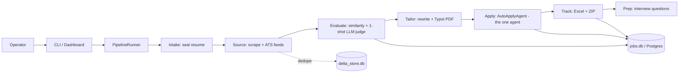

# Job Agent — Quick Reference

> Short version of [`JOB_AGENT_COMPLETE_ARCHITECTURE.md`](JOB_AGENT_COMPLETE_ARCHITECTURE.md).
> Verified against source 2026-10-04. Read the full doc for file-level detail
> and the "not fully verified" caveats.

## One-page explanation

This is a **local Python CLI pipeline**, not a web app. One command,
`python main.py <phase>`, runs each of seven fixed phases: it reads your
resume and cryptographically seals every fact in it, fetches real job
postings and dedupes them, scores them (cheap similarity filter, then one
LLM call per promising job), rewrites and compiles a tailored PDF for the
ones that qualify, fills out the real application form in a browser (the
only genuine "agent" in the codebase — a bounded, LLM-free DOM loop), tracks
every outcome in an Excel workbook, and drafts interview prep from facts
already in your resume. An optional local dashboard is just a second way to
trigger the same engine — not a separate backend.

## Main architecture

```text
                    +----------------------+
                    |  OPERATOR (one user)  |
                    +----------+-----------+
                               |
            +------------------+-------------------+
            |                                       |
            v                                       v
+-----------------------+              +---------------------------+
| CLI (cli.py, click)   |              | Dashboard (web/server.py) |
| 26 commands           |              | stdlib HTTP, loopback only|
+-----------+-----------+              +-------------+-------------+
            |                                        |
            +-------------------+--------------------+
                                |
                                v
               +----------------------------------+
               |   PipelineRunner (web/runner.py)  |
               |   THE ORCHESTRATOR — fixed list,   |
               |   no graph, no LangChain/LangGraph |
               +----------------+-------------------+
                                |
   intake -> source -> evaluate -> tailor -> apply -> track -> prep
                                |
                                v
               +----------------------------------+
               | jobs.db / Postgres + delta_store.db|
               | + JSON artifacts on disk            |
               +----------------------------------+
```



## Number of agents: 1

**`AutoApplyAgent`** (`src/job_agent/automation/agent.py`) — a bounded DOM
loop (max 25 steps, max 3 consecutive errors, submits at most once) that
fills real application forms. No LLM inside the loop; pure DOM heuristics.
Everything else (reranker, tailoring, interview prep) is a one-shot LLM
call with a deterministic fallback — not an agent.

## Orchestrator

`PipelineRunner` in `src/job_agent/web/runner.py`. A plain Python `for`
loop over `PHASE_ORDER = ["intake","source","evaluate","tailor","apply",
"track","prep"]` (`web/state.py`). Shared, unmodified, by both the CLI and
the dashboard. **No LangChain. No LangGraph.** A failed phase ends the run
(no auto-retry); cancellation is cooperative; a cross-process file lock
(`runtime.pipeline_lock`) prevents concurrent runs.

## Core workflow

1. **Intake** — `intake/parser.py` + `validator.py`: resume → SHA-256-sealed `profile.json`.
2. **Source** — `sourcing/scraper.py` (JobSpy) + `ats_direct.py` (Greenhouse/Lever/Ashby) → deduped via `sourcing/delta_store.py`.
3. **Evaluate** — `evaluation/embedder.py` (Tier 1 cosine similarity) → `evaluation/reranker.py` (Tier 2, one LLM call, `fit_score` 1–10).
4. **Tailor** — `tailoring/rewriter.py` (metric-integrity gate) + `tailoring/compiler.py` (Typst PDF).
5. **Apply** — `automation/agent.py` `AutoApplyAgent` (the one agent), dry-run by default.
6. **Track** — `tracking/tracker.py` (Excel) + `tracking/bundle.py` (ZIP) + `jobs_db.sync()`.
7. **Prep** — `interview/pipeline.py`, evidence gated through `generation.py`'s `verified_evidence()`.

## Technology stack

| Layer | Technology |
| --- | --- |
| Interface | `click` CLI (primary) + stdlib `http.server` dashboard (secondary) |
| Database | SQLite (default) or Postgres (`DATABASE_URL`) — raw SQL, no ORM |
| LLM | Groq (default), OpenAI, Anthropic — provider-selected, one-shot calls, deterministic fallback everywhere |
| Agent framework | None — custom Python loop |
| Browser automation | Playwright |
| PDF generation | Typst |
| Scheduling | None in-process; external (Windows Task Scheduler) for `daily` |
| Background worker | `hosted/worker.py` exists but is a stub, not wired in |

## Important DB tables (`jobs.db`)

`jobs`, `job_source_listings`, `job_matches`, `job_evaluation_history`,
`applications`, `application_events`, `resume_artifacts`, `job_contacts`,
plus legacy `job_resumes`/`job_evaluations`/`job_applications`. View:
`job_overview` (what the dashboard reads). Separate file `delta_store.db`:
`seen_jobs` (lifecycle/dedup), `application_attempts`, `outreach_log`.

## Major "APIs"

Not a public REST API — a loopback-only dashboard server
(`web/server.py`): `/api/state`, `/api/events` (SSE), `/api/run`,
`/api/jobs`, `/api/runs`, `/api/analytics`, plus upload/config POST routes.
A separate, **unwired** hosted scaffold (`hosted/api.py`) exists for a
possible future multi-tenant deployment: `/health`, `/jobs`, `POST /runs`
(enqueue only — the paired `hosted/worker.py` doesn't actually execute runs
yet).

## What's real vs. not

| | |
| --- | --- |
| **Real, tested** | 7-phase pipeline, 4 anti-hallucination gates, 1 bounded agent, dashboard, DB sync, Excel/ZIP export, opt-in IMAP reply tracking, deterministic warm-contact discovery |
| **Stub / not wired in** | `hosted/worker.py` (queue consumer that doesn't execute), production-grade queue (Redis et al. — named as a future option, not in use) |
| **Not present at all** | Frontend framework, REST API framework, LangChain, LangGraph, ORM, in-process scheduler, general-purpose cache, notification service |

Full detail, caveats, and the items explicitly marked "not fully verified":
see [`JOB_AGENT_COMPLETE_ARCHITECTURE.md`](JOB_AGENT_COMPLETE_ARCHITECTURE.md).
