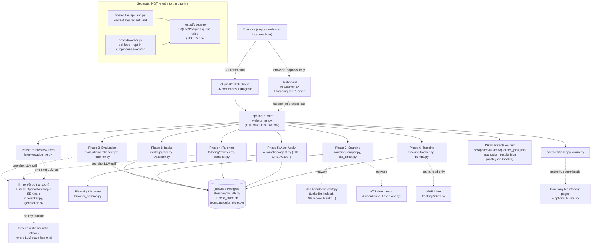
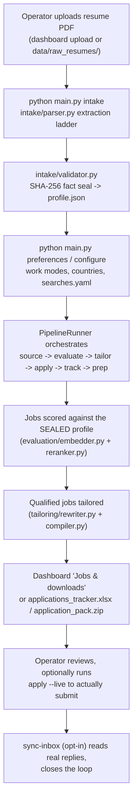
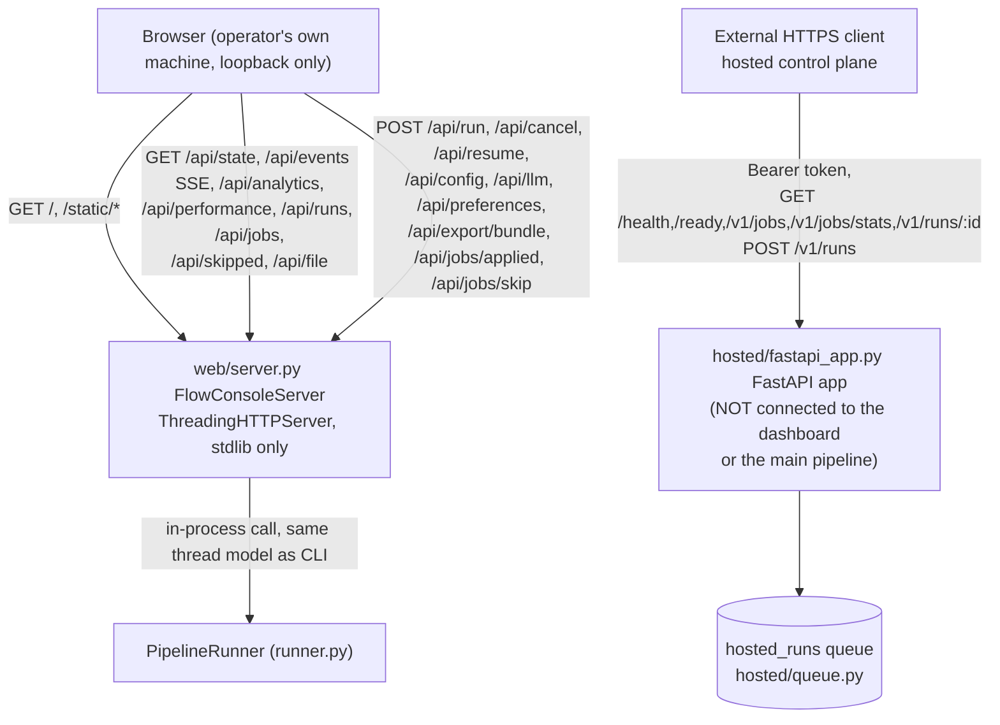

# Job Agent — Complete Architecture (Verified Against Source)

> **Verified**: 2026-10-04, by opening and reading the actual files listed under
> "Source-of-truth mapping" below — not inferred from `docs/ARCHITECTURE.md`,
> `docs/AGENT_DESIGN.md`, or prior conversation. Where those docs disagreed
> with the code, the code wins; discrepancies are called out explicitly.
> Anything not directly read is marked **Unable to verify from the current
> codebase** rather than guessed.

---

## 0. What this project actually is

**A single-process, local Python CLI application** (`click`-based) that runs a
seven-phase pipeline over a candidate's resume and real job postings, plus an
optional local dashboard (stdlib HTTP server, no framework) that drives the
exact same pipeline code. There is:

- **No frontend framework** (no React/Vue/Next — `frontend/` does not exist).
- **FastAPI exists only for the separate hosted control plane**; the local
  dashboard remains stdlib `http.server`.
- **No LangChain or LangGraph** anywhere in the codebase.
- **No Celery/Redis task queue** in production use; hosted runs use a narrow
  SQLite/Postgres queue and an opt-in subprocess worker.
- **No ORM** (no SQLAlchemy/Alembic) — raw SQL against SQLite or Postgres.
- **No in-process scheduler** (no APScheduler/cron library) — the `daily`
  cadence is triggered externally (Windows Task Scheduler), not by Python.

This single fact reframes every section below: there is one orchestrator, one
execution engine, and exactly one thing in the whole codebase that behaves
like an "agent" in the iterative perceive-reason-act sense.

---

## 1. System overview

```text
Resume PDF → profile.json (sealed) → scraped_jobs.json → qualified_jobs.json
→ tailored PDFs/cover letters → application_results.json → tracker.xlsx +
application_pack.zip → interview_prep.json
```

Entry points: `main.py` and `python -m job_agent` both delegate to
`src/job_agent/cli.py`'s single `click.Group` (`cli`). There is no WSGI/ASGI
app, no `manage.py`, no separate backend process — the CLI *is* the backend.

---

## 2. Actual system components (only what was found)

| Component | Exists? | Evidence |
| --- | --- | --- |
| Frontend (SPA/framework) | **No** | No `frontend/` directory; dashboard is server-rendered static HTML + vanilla JS (`web/static/`) |
| Backend/API layer | **Yes** | Local dashboard: `web/server.py` hand-rolled `http.server.ThreadingHTTPServer`, loopback-only. Hosted control plane: `hosted/fastapi_app.py` FastAPI bearer-auth API. |
| CLI (the real primary interface) | **Yes** | `src/job_agent/cli.py`, `click.Group`, 26 commands + `db` group |
| Authentication | **Partial, local-only** | Dashboard: per-session token + optional HTTP Basic Auth (`DASHBOARD_USERNAME/PASSWORD`). Hosted API: bearer API keys (`hosted/auth.py`). No user-account login system for the CLI itself — it's a single-operator tool |
| Orchestrator | **Yes** | `src/job_agent/web/runner.py`'s `PipelineRunner` — used identically by CLI and dashboard |
| Job Sourcing | **Yes** | `sourcing/scraper.py` (JobSpy boards), `sourcing/ats_direct.py` (Greenhouse/Lever/Ashby), `sourcing/public_feeds.py` |
| Job Deduplication | **Yes** | `sourcing/delta_store.py`'s `DeltaStore` — SQLite/Postgres, dedupes by job ID *and* a company+title fingerprint |
| Job Evaluation/Matching | **Yes** | `evaluation/embedder.py` (Tier 1 cosine similarity), `evaluation/reranker.py` (Tier 2 LLM judge, one-shot) |
| Ranking | **Implicit in scoring** | `fit_score` from the reranker; no separate re-ranking stage beyond the evaluation pipeline |
| Resume Parsing | **Yes** | `intake/parser.py` (multi-strategy ladder), `intake/heuristic.py` (regex fallback) |
| Tailoring/Document generation | **Yes** | `tailoring/rewriter.py`, `tailoring/compiler.py` (Typst) |
| Automation (browser apply) | **Yes — the one real agent** | `automation/agent.py`'s `AutoApplyAgent` |
| Database | **Yes** | `storage/jobs_db.py` (SQLite default, Postgres via `DATABASE_URL`), raw SQL |
| Cache | **Not found as a general cache** | Only a narrow `evaluation/embedding_cache.py` for embedding vectors — **unable to verify its mechanism without opening it**; no Redis/Memcached anywhere |
| Scheduler | **No (in-process)** | Confirmed by grep: no APScheduler/cron library. External scheduling only (Windows Task Scheduler via `scripts/start_dashboard.ps1`, not opened) |
| Worker/queue | **Yes, hosted path only** | `hosted/queue.py` + `hosted/worker.py` claim durable runs; validation is default, subprocess phase execution is opt-in with per-user workspaces |
| Notification Service | **Not found** | No email-sending, Slack, or push-notification code found; cold email is drafted only, never sent (`tracking/cold_email.py`) |
| Application Tracking | **Yes** | `tracking/tracker.py` (Excel), `tracking/bundle.py` (ZIP pack), `tracking/inbox.py` (read-only IMAP reply classification) |
| Analytics | **Yes** | `web/analytics.py`, exposed via `/api/analytics` — **not opened in full, existence confirmed by call sites only** |
| Logging/Monitoring | **Partial** | stdout/stderr captured into SSE log lines by `_LineTee` (runner.py); `main.py doctor`/`quality`/`performance`/`production-check` are self-check commands, not a metrics/observability stack |

---

## 3. AI Agents — inventory

**Total number of actual agents currently implemented: 1**

Only `AutoApplyAgent` meets a real definition of "agent" (an autonomous loop
that perceives a changing environment, decides an action, acts, and repeats
until a bound or goal is hit). Everything else in the pipeline is a one-shot
service: it receives input, makes at most one LLM call (with a deterministic
fallback), and returns a result — no loop, no iterative tool use, no planning.

### Agent 1 — `AutoApplyAgent`

| Field | Details |
| --- | --- |
| Agent Name | `AutoApplyAgent` |
| File/Module | `src/job_agent/automation/agent.py` |
| Responsibility | Fill (and, outside assist mode, submit) a real job-application form in a live browser, one DOM action at a time |
| Input | A `JobPosting`, the sealed `CandidateProfile`, a tailored resume PDF path, `dry_run`/`assist_workday` flags |
| Output | An `ApplicationOutcome` (status, steps taken, error if any) |
| Tools Used | `automation/navigator.py` (`DOMNavigator` — scans form fields, finds submit/next buttons, detects success), `automation/form_filler.py` (`FormFiller` — answers factual questions, leaves unknown ones blank), `automation/hitl.py` (`ChallengeHandler` — pauses for CAPTCHA/MFA) |
| LLM Used | **None.** Confirmed: purely deterministic DOM heuristics, no vision model (`settings.use_vision` defaults `False`), module docstring states DOM-only |
| Framework | Custom Python loop over Playwright (`automation/browser_session.py`), no agent framework |
| Trigger | `python main.py apply` (via `AutoApplyPipeline`) or `python main.py workday-assist` (direct, human-in-the-loop) |
| Next Step | `ApplicationOutcome` is written to `application_results.json`, then feeds Phase 6 (Tracking) |
| Database Interaction | Reads nothing directly from the DB; writes nothing directly — the calling pipeline (`automation/pipeline.py`) is responsible for persisting outcomes to `jobs_db`/`delta_store` |

**Loop mechanics** (agent.py): `while steps < self.max_steps` (default 25,
`settings.max_application_steps`), aborts after 3 consecutive errors
(`MAX_CONSECUTIVE_ERRORS = 3`), submits at most once (`submit_attempted`
flag), and disables cooperative cancellation once a submission is in flight
so a half-submitted application is never abandoned.

### Explicitly NOT agents (one-shot services, for contrast)

| Name | File | Why it's not an agent |
| --- | --- | --- |
| `LLMReranker` | `evaluation/reranker.py` | One LLM call per job (`evaluate_job()`), validated against a pydantic schema, deterministic heuristic fallback on failure — no loop |
| `ResumeTailorer` | `tailoring/rewriter.py` | Rewrites bullets via a single generation pass plus a validation gate; not confirmed to loop (grep found no loop construct) |
| `InterviewPrepPipeline` | `interview/pipeline.py` | Generates a fixed set of questions per job in one pass — **LLM call shape not fully verified, not opened in full** |
| `CompanySiteCrawler` / warm-contact finder | `contacts/finder.py`, `contacts/warm.py` | Deterministic web crawling with no LLM at all, bounded by a page/result limit, not an LLM-reasoning loop |
| `PipelineRunner` | `web/runner.py` | This is the **orchestrator**, not an agent — it sequences fixed phases, it doesn't reason about what to do next |

---

## 4. The Orchestrator

> **Correction to a prior/stale assumption**: `src/job_agent/workflow.py` is
> **not** the orchestrator. It contains only `write_run_report()` and
> `publish_outputs()` — output-publishing helpers (CSV export, DB sync,
> quality/performance reports, ZIP bundling) called *after* each phase, not
> phase sequencing itself. The real orchestrator lives in `web/runner.py`.

### Where it is

**`PipelineRunner`, `src/job_agent/web/runner.py`** (573 lines). Used
identically by:
- the CLI (`run-pipeline`, `daily`, `repair` commands, via `run_sync()`), and
- the dashboard (`/api/run` endpoint, via `.start()` which backgrounds the
  same `_run` method in a `threading.Thread`).

This means **there is exactly one pipeline execution engine in the entire
project** — not two parallel implementations for CLI vs. web.

### Phase order

Defined once, in `src/job_agent/web/state.py`:

```python
PHASE_ORDER = ["intake", "source", "evaluate", "tailor", "apply", "track", "prep"]
```

Seven phases, always in this fixed order. Not a graph — a straight list.

### How it starts

- CLI: `cli.py`'s `_run_pipeline_sync()` (lines 828–885) builds the phase
  list (prepends `"intake"` unless `--skip-intake`) and an `options` dict
  (`resume`, `dry_run`, `threshold`, `limit`, `tailoring_mode`, `track_all`,
  `assume_yes`, `started_from`, `cover_letter`), then calls
  `PipelineRunner().run_sync(phases, options)`.
- Dashboard: `/api/run` POST handler in `web/server.py` calls
  `runner.start(phases, options)` directly — in-process, no subprocess.

### Execution sequence (`_run_locked`, runner.py:212–321)

1. Write initial `run_report.json` (status `"running"`), generate a `run_id`,
   open a `RunHistory` record.
2. `for name in phases:` — iterate in the fixed order given.
3. Before each phase, check `self._cancel.is_set()` (cooperative
   cancellation via `runtime.cancellation()`/`check_cancelled()` — a
   thread-local `threading.Event` polled at loop boundaries, never
   mid-write).
4. Redirect stdout/stderr through `_LineTee` so console output becomes SSE
   log lines the dashboard streams live.
5. Call `_PHASE_IMPLS[name](options, self._cancel)` — a dict mapping phase
   name to a phase function (`_phase_intake`, `_phase_source`,
   `_phase_evaluate`, `_phase_tailor`, `_phase_apply`, `_phase_track`,
   `_phase_prep`), each of which imports and calls the same pipeline class
   the equivalent standalone CLI subcommand uses. **One code path per phase**,
   whether run individually or as part of the full pipeline.
6. In a `finally` block after every phase: call `workflow.publish_outputs()`
   so CSV/DB/quality/performance artifacts stay current even after a partial
   run.

### State management

Not an explicit state machine or graph state object — state is the **options
dict** passed through, plus whatever each phase reads/writes to disk
(JSON files) and the database. The dashboard and CLI derive their view of
"what happened" by reading the same files back (`web/state.py` docstring:
state is computed live from disk each request, not cached in memory), so a
dashboard restart never desyncs from the CLI's last run.

### Decision making / branching

Minimal — this is a sequencer, not a planner:
- A phase that raises an exception ends the whole run (`overall = "error"`),
  caught at `_run()`'s top level so the CLI/dashboard gets a clean error
  instead of a traceback.
- A phase that completes but produces nothing useful (e.g. zero jobs
  sourced, zero jobs qualified) can set `halt_reason`, which ends the run
  cleanly as `overall = "halted"` — **not** treated as an error.
- `RunCancelled` (user hit cancel) ends the run as `overall = "cancelled"`.
- **No automatic retries of a failed phase.** A failure stops the pipeline;
  the operator re-runs manually (or via `repair`, which reruns a specific
  downstream subset).

### Locking (how concurrent runs are prevented)

`runtime.py`'s `pipeline_lock()` combines an in-process `threading.RLock`
with an OS-level file lock on `data/outputs/.pipeline.lock`
(`msvcrt.locking` on Windows, `fcntl.flock` on POSIX), so the CLI and the
dashboard's background thread can never write pipeline artifacts at the same
time. `@exclusive_run` wraps `run-pipeline`, `daily`, `repair`, and
`workday-assist` in this lock.

### Final output

`run_report.json` (status, timings, per-phase summaries, warnings),
re-published `jobs_latest.csv`/`applications_ready.csv`/master CSV, a
refreshed `jobs.db`, and — when a bundle is requested — the
`application_pack.zip`.

### Is LangGraph/LangChain used?

**No. Verified by direct code inspection, not assumption.** No `langgraph`
or `langchain` import exists anywhere in `src/`. There is no graph, no nodes,
no edges, no conditional-edge routing, no LangGraph `StateGraph`. The
"orchestration" is a plain Python `for` loop over a fixed list of phase
names, with a dict dispatch to phase functions. If this project ever adopts
LangGraph, `PipelineRunner._run_locked`'s `for name in phases:` loop and
`_PHASE_IMPLS` dict are exactly what a `StateGraph` with linear edges would
replace — but that migration has not happened.

---

## 5. Master System Architecture

### Diagram 1 — High-Level System Architecture



### ASCII version (main architecture, for non-Mermaid viewing)

```text
                         +----------------------+
                         |  OPERATOR (one user)  |
                         +----------+-----------+
                                    |
                 +------------------+-------------------+
                 |                                       |
                 v                                       v
     +-----------------------+              +---------------------------+
     | CLI (cli.py, click)   |              | Dashboard (web/server.py) |
     | 26 commands + db group|              | stdlib HTTP, loopback only|
     +-----------+-----------+              +-------------+-------------+
                 |                                        |
                 +-------------------+--------------------+
                                     |
                                     v
                    +----------------------------------+
                    |   PipelineRunner (web/runner.py)  |
                    |   == THE ORCHESTRATOR             |
                    |   fixed phase list, no graph       |
                    +----------------+-------------------+
                                     |
    +------------+------------+------+------+------------+------------+
    v            v            v             v            v            v
 Intake      Sourcing    Evaluation     Tailoring    Auto-Apply    Tracking
(parser)   (scraper,    (embedder +   (rewriter +   (AutoApply-   (tracker,
(validator) ats_direct)  reranker:     compiler:      Agent:        bundle,
                         1-shot LLM)    Typst PDF)    THE ONE        inbox)
                                                       AGENT,             |
                                                       no LLM)        +--+--+
                                                           |          |     |
                                                           v          v     v
                                                      Playwright  Interview Prep
                                                      browser     (interview/
                                                                   pipeline.py)
                                     |
                                     v
                    +----------------------------------+
                    |  jobs.db / Postgres (jobs_db.py)  |
                    |  delta_store.db (dedup/lifecycle) |
                    |  + JSON artifacts on disk          |
                    +----------------------------------+
```

---

## 6. Complete end-to-end job processing pipeline

### Diagram 3 — Job Processing Pipeline

```mermaid
flowchart LR
    SRC["Job boards (JobSpy) +\nATS feeds (Greenhouse/Lever/Ashby)"] --> FETCH["scraper.py / ats_direct.py\nfetch raw postings"]
    FETCH --> NORM["schema.py JobPosting\npydantic validation\n(StrictModel, extra=forbid)"]
    NORM --> DEDUP["delta_store.py DeltaStore.filter_unseen()\nby job.id AND company+title fingerprint"]
    DEDUP -->|unseen only| SCRAPED["scraped_jobs.json\n+ seen_jobs table (status='scraped')"]
    SCRAPED --> EVAL1["embedder.py\nTier 1: cosine similarity vs profile"]
    EVAL1 -->|passes tier1_threshold| EVAL2["reranker.py LLMReranker\nTier 2: one-shot LLM judge, fit 1-10\n(deterministic heuristic if no LLM)"]
    EVAL1 -->|fails tier1_threshold| DROP1["prefilter_rejected"]
    EVAL2 -->|fit_score >= min_match_score| QUAL["qualified_jobs.json\nstatus='qualified'"]
    EVAL2 -->|below threshold| DROP2["evaluated_rejected"]
    QUAL --> TAILOR["rewriter.py + compiler.py\nbullets rewritten, metric-integrity gate,\nTypst PDF compiled"]
    TAILOR --> APPLY["automation/agent.py AutoApplyAgent\nbounded DOM loop, submit<=1x"]
    APPLY --> RESULTS["application_results.json\nstatus='applied'/'failed'/'dry_run'"]
    RESULTS --> TRACK["tracker.py + jobs_db.sync()\napplications_tracker.xlsx"]
```



### Step-by-step

#### STEP 1 — Fetch
**Input**: `config/searches.yaml` (`SearchParameters`: domains, locations,
work modes, job boards).
**Process**: `sourcing/scraper.py`'s `OmnichannelScraper` calls
`python-jobspy` across configured boards; `sourcing/ats_direct.py` hits
public Greenhouse/Lever/Ashby JSON APIs directly for configured companies.
**Technology**: Python, `requests`/`python-jobspy`, no async framework.
**Output**: raw per-board job dicts.
**Next destination**: normalization.
**Database effect**: none yet.

#### STEP 2 — Normalize / validate
**Input**: raw job dicts from each source.
**Process**: coerced into `config/schema.py`'s `JobPosting` pydantic model
(`StrictModel`, `extra="forbid"`) — unexpected/renamed fields are a hard
validation error, not silently dropped. `job.id` is a deterministic hash
(`create_id()`); `job.fingerprint()` is a separate company+title-only
identity used for cross-board dedup.
**Technology**: pydantic.
**Output**: validated `JobPosting` objects.
**Next destination**: deduplication.
**Database effect**: none yet.

#### STEP 3 — Deduplicate
**Input**: validated `JobPosting` list.
**Process**: `sourcing/delta_store.py`'s `DeltaStore.filter_unseen()` drops
any job already present by `job_id` **or** by fingerprint (so the same role
reposted on a different board isn't treated as new), unless it was
explicitly `reopened` for a new candidate profile.
**Technology**: SQLite (default) or Postgres (`DATABASE_URL`), raw SQL.
**Output**: only genuinely new postings.
**Next destination**: `scraped_jobs.json` + evaluation.
**Database effect**: `INSERT OR IGNORE` into `seen_jobs` (status
`"scraped"`).

#### STEP 4 — Evaluate (Tier 1)
**Input**: unseen postings + sealed `CandidateProfile`.
**Process**: `evaluation/embedder.py` computes cosine similarity between
resume and job-description embeddings (`sentence-transformers/all-MiniLM-L6-v2`
or TF-IDF fallback) — free, fast prefilter.
**Technology**: Python, sentence-transformers or TF-IDF.
**Output**: jobs passing `tier1_threshold` move on; others marked
`prefilter_rejected`.
**Next destination**: Tier 2 judge.
**Database effect**: status update in `seen_jobs`.

#### STEP 5 — Evaluate (Tier 2)
**Input**: Tier-1-passing jobs + profile.
**Process**: `evaluation/reranker.py`'s `LLMReranker.evaluate_job()` makes
**one** LLM call per job (provider per `settings.active_provider`), parses
the response into `RerankerVerdict` (strict pydantic, with a `_coerce_score`
validator for common LLM scale mistakes), falls back to a deterministic
heuristic judge if no provider is configured or the call fails.
`passed_threshold` is **always derived programmatically** from
`fit_score >= threshold_used`, never trusted from the LLM.
**Technology**: Groq/OpenAI/Anthropic (one-shot JSON-mode completion), or
pure Python heuristic.
**Output**: `EvaluatedJob` (job + `EvaluationScore`).
**Next destination**: jobs at/above `min_match_score` (default 7.0) become
`qualified_jobs.json`.
**Database effect**: append to `job_evaluation_history`; upsert
`job_matches`; status update in `seen_jobs` (`"qualified"` or
`"evaluated_rejected"`).

#### STEP 6 — Tailor
**Input**: qualified jobs + profile.
**Process**: `tailoring/rewriter.py`'s `ResumeTailorer` rewrites bullets
per role, then runs `enforce_metric_integrity()` — the restore-or-drop
anti-hallucination gate (a dropped locked metric is reinstated, an invented
one is stripped). `tailoring/compiler.py` compiles the result to a
single-column ATS PDF via Typst (~100ms).
**Technology**: Python + one-shot LLM call (or faithful/no-LLM mode) +
Typst binary.
**Output**: `manifest.json` (`TailoredResumeRecord` entries), tailored PDFs,
optional cover letters.
**Next destination**: Auto-Apply + Tracking.
**Database effect**: `resume_artifacts` row per PDF (sha256, size).

#### STEP 7 — Apply
**Input**: tailored PDF + job + profile.
**Process**: `automation/agent.py`'s `AutoApplyAgent` — the one real agent —
loops up to 25 DOM steps, filling fields via `form_filler.py` (blank, never
guessed, for anything with no backing fact), detecting and clicking
submit/next via `navigator.py`, pausing for CAPTCHA/MFA via `hitl.py`.
Submit fires at most once. `workday-assist` runs the identical agent but
always stops before clicking submit.
**Technology**: Playwright (persistent Chromium profile).
**Output**: `ApplicationOutcome` per job.
**Next destination**: `application_results.json` → Tracking.
**Database effect**: handled by the calling `automation/pipeline.py`, not
the agent itself — writes to `applications`/`application_events` and
`seen_jobs` (`"applied"`/`"failed"`).

#### STEP 8 — Track
**Input**: `application_results.json` + qualified jobs + manifest.
**Process**: `tracking/tracker.py` writes/updates
`applications_tracker.xlsx` (idempotent via hidden Job ID column);
`tracking/bundle.py` assembles `application_pack.zip`; `jobs_db.sync()`
mirrors everything into the relational DB; `workflow.publish_outputs()`
regenerates CSVs and quality/performance reports after every phase,
regardless of success.
**Technology**: `openpyxl` (Excel), SQLite/Postgres.
**Output**: Excel workbook, ZIP pack, refreshed CSVs.
**Next destination**: the operator, via the dashboard's "Jobs & downloads" view.
**Database effect**: full sync of `jobs`, `applications`, `application_events`.

---

## 7. User flow

### Diagram 4 — User Recommendation Flow



There is no "login" in the product sense — this is a single-operator local
tool. The closest things to auth are: the dashboard's session token/Basic
Auth (protecting *access to the local tool*, not a multi-user account
system), and the hosted API's per-user bearer keys (a separate, unwired
scaffold for a possible future multi-tenant deployment).

---

## 8. Database architecture

**Technology**: SQLite by default (`data/outputs/jobs.db`, stdlib `sqlite3`);
Postgres if `DATABASE_URL` is set (via `psycopg`, optional `psycopg_pool`).
**ORM**: **none** — raw SQL, with a `_sql()` translation helper in both
`jobs_db.py` and `delta_store.py` that rewrites `?` → `%s`, `BLOB` → `BYTEA`,
`AUTOINCREMENT` → `BIGSERIAL`, `CREATE VIEW IF NOT EXISTS` → `CREATE OR
REPLACE VIEW`, so the same SQL source serves both backends.
**Migrations**: hand-written, tracked in a `schema_migrations(version, name,
applied_at)` table, applied additively by `run_migrations()` — not a
replay-from-empty system like Alembic. `JobsDatabase._init_db()` first runs
`CREATE TABLE IF NOT EXISTS` for the full schema, then applies migrations.

### Diagram 5 — Database architecture (two separate SQLite/Postgres stores)

```text
jobs.db / Postgres (storage/jobs_db.py)
========================================
  users ──┬── candidate_profiles
          ├── candidate_preferences
          └── resumes
                 │
                 â–¼
  jobs ──┬── job_source_listings  (per-board listing identity, raw_payload JSON)
         ├── job_matches          (candidate-specific scores, unique per
         │                         candidate+job+scoring_version+profile_hash)
         ├── job_evaluation_history (append-only, every evaluation run)
         ├── applications          (current state, unique per candidate+job)
         │      └── application_events (append-only timeline)
         ├── resume_artifacts      (sha256, size, storage metadata per resume PDF)
         ├── interview_prep_artifacts (guide path/json path, sha256, question count)
         ├── cover_letter_artifacts (PDF path, sha256, validation/profile metadata)
         └── job_contacts

  Legacy/simple tables still maintained in parallel:
  job_resumes (stores PDF bytes as BLOB), job_evaluations, job_applications,
  candidate_profile (singleton id=1), search_parameters (singleton id=1),
  phase_runs, runs, run_jobs, job_outreach

  View: job_overview — joins jobs + latest job_matches + latest applications
  + best job_contacts + job_outreach + resume paths into one row per job
  (what `db query`/the dashboard's jobs list actually reads)

delta_store.db (sourcing/delta_store.py) — SEPARATE small SQLite/Postgres DB
========================================
  seen_jobs (job_id PK, fingerprint, status, status_updated_at, reopened)
      — lifecycle: scraped -> evaluated -> qualified|evaluated_rejected
        |prefilter_rejected -> tailored -> applied|failed|fallback_logged
        -> replied_rejection|replied_interview|replied_offer|replied_other
        (or skipped)
  application_attempts (candidate_id, job_id) — atomic claim to prevent a
      double-apply race
  outreach_log (recipient, fingerprint) — no-repeat ledger for drafted
      cold emails
  delta_meta (key/value) — tracks whose profile.json the current statuses
      belong to; a changed candidate identity reopens previously-judged jobs

hosted_queue.db or Postgres hosted_runs (hosted/queue.py) - hosted control plane queue
========================================
  hosted_runs (id, user_id, phases_json, options_json, status, error,
      idempotency_key, attempts, max_attempts, claimed_at, started_at,
      heartbeat_at, finished_at, created_at, updated_at) - durable hosted
      run requests with retry-safe creation and recoverable worker leases
```

**Why two live databases**: `jobs_db.py` is the rich, queryable record of
everything ever fetched/scored/tailored/applied/replied-to (the system of
record for the dashboard and CSV/Excel exports). `delta_store.py` is a
narrower, faster lifecycle/dedup ledger that the sourcing and tracking
phases consult on every run to avoid reprocessing the same posting. They are
kept in sync by each phase updating both, not by a foreign key between the
two files — **this is a real design tradeoff** (two sources of truth that
must be kept consistent by convention), not a single normalized database.

### Where data is saved

| Data | Source | Processing | Storage | Table/File | Used by |
| --- | --- | --- | --- | --- | --- |
| Candidate profile | Resume PDF upload | `intake/parser.py` extraction ladder + `validator.py` SHA-256 seal | JSON file + DB | `data/profiles/profile.json`; `candidate_profiles`/`candidate_profile` | Evaluation, Tailoring, Apply, Prep (all re-verify the seal) |
| Raw job postings | JobSpy / ATS feeds | `JobPosting` pydantic validation | JSON + SQLite/Postgres | `scraped_jobs.json`; `jobs`, `job_source_listings` | Evaluation |
| Dedup/lifecycle state | Every phase | status transitions | SQLite/Postgres | `delta_store.db`'s `seen_jobs` | Sourcing (skip-already-seen), `status`/`reset` CLI |
| Evaluation scores | `reranker.py`/`embedder.py` | Tier1+Tier2 scoring, `passed_threshold` derived in code | JSON + DB | `evaluated_jobs.json`, `qualified_jobs.json`; `job_matches`, `job_evaluation_history` | Tailoring (which jobs to tailor for), dashboard job list |
| Tailored resumes/cover letters | `rewriter.py` + `compiler.py` | metric-integrity gate, Typst compile | PDF files + DB metadata | `data/outputs/tailored_resumes/*.pdf`; `resume_artifacts`, `job_resumes` (legacy BLOB) | Apply, Tracking |
| Application outcomes | `automation/agent.py` via `automation/pipeline.py` | status derived from `"applied"` string match, never trusted raw | JSON + DB | `application_results.json`; `applications`, `application_events`, `job_applications` (legacy) | Tracking, Analytics |
| Tracker workbook | `tracking/tracker.py` | idempotent upsert by hidden Job ID | XLSX file | `data/outputs/applications_tracker.xlsx` | Operator download |
| Interview prep | `interview/pipeline.py` | STAR evidence gated through `generation.py`'s `verified_evidence()` | JSON | `data/outputs/interview_prep.json` | Dashboard, ZIP bundle |
| Inbox replies (opt-in) | IMAP, read-only | classified rejection/interview/offer/other | DB status update | `seen_jobs.status` (`replied_*`) | Tracking/analytics |

---

## 9. Job data lifecycle (one job, field by field)

```text
External posting (board/ATS JSON)
    │  raw dict, source-specific field names
    â–¼
scraper.py / ats_direct.py            — fields renamed/extracted into a dict
    │
    â–¼
schema.py JobPosting(**dict)          — strict pydantic validation; ADDS:
    │                                    id (deterministic hash), discovered_at
    â–¼
DeltaStore.filter_unseen()            — REMOVES jobs whose id OR fingerprint
    │                                    already exists in seen_jobs
    â–¼
seen_jobs row inserted (status='scraped')     [delta_store.db]
scraped_jobs.json entry written               [disk]
    │
    â–¼
embedder.py (Tier 1)                  — ADDS: embedding_similarity
    │   below tier1_threshold → status='prefilter_rejected', stops here
    â–¼
reranker.py (Tier 2)                  — ADDS: fit_score, technical_score,
    │                                    seniority_score, reasoning,
    │                                    matching_skills[], missing_skills[]
    │                                    passed_threshold COMPUTED, not trusted
    │   below min_match_score → status='evaluated_rejected', stops here
    â–¼
qualified_jobs.json entry; job_matches row    [disk + jobs.db]
status='qualified'                            [delta_store.db]
    │
    â–¼
rewriter.py + compiler.py             — ADDS: tailored PDF path, pdf_sha256,
    │                                    restored_metrics[], dropped_fabrications[]
    â–¼
manifest.json entry; resume_artifacts row     [disk + jobs.db]
status='tailored'                             [delta_store.db]
    │
    â–¼
automation/agent.py AutoApplyAgent    — ADDS: status (applied/failed/dry_run),
    │                                    steps_taken, error
    â–¼
application_results.json; applications row    [disk + jobs.db]
status='applied'/'failed'                     [delta_store.db]
    │
    â–¼
tracker.py / bundle.py                — surfaces the job in
                                          applications_tracker.xlsx and
                                          application_pack.zip
    │
    â–¼
Displayed in dashboard "Jobs & downloads"  (reads job_overview VIEW)
```

---

## 10. Agent communication

With only one true agent, there is no multi-agent communication protocol to
document. The relevant communication pattern is **orchestrator → phase
function → pipeline class**, not **agent → agent**:

- **Direct function calls, in-process.** `PipelineRunner` calls
  `_phase_apply(options, cancel)`, which directly instantiates
  `AutoApplyPipeline`, which directly instantiates `AutoApplyAgent` per job.
  No HTTP, no queue, no message bus between phases.
- **Shared database + shared JSON files** are the only "memory" passed
  between phases — each phase reads the previous phase's JSON/DB output and
  writes its own. This is closer to a Unix-pipeline style (files as the
  interface) than an agentic message-passing architecture.
- The hosted scaffold (`hosted/queue.py`) is the only place anything
  resembling async message passing exists (a claim-based SQL queue), and it
  is **not connected** to the main pipeline.

---

## 11. LLM / LangChain / LangGraph architecture

### LangChain
**Not currently used in the implementation.** No `langchain` import anywhere
in `src/`.

### LangGraph
**Not currently used in the implementation.** No `langgraph` import, no
`StateGraph`, no graph nodes/edges/conditional routing anywhere in `src/`.
Orchestration is a plain Python loop (§4).

### LLM integration (what is actually there)

`src/job_agent/llm.py` implements **only the Groq transport**
(`GroqClient`/`groq_complete()`) — direct `requests.post()` to
`https://api.groq.com/openai/v1/chat/completions`. OpenAI and Anthropic calls
are made **inline, per-module**, directly against the `openai`/`anthropic`
SDKs (e.g. `reranker.py._call_openai`/`_call_anthropic`,
`generation.py.complete_json`) — there is no single central LLM client
abstraction; `settings.active_provider`/`settings.model_for(stage)` is the
provider-selection mechanism each stage consults independently.

```text
┌───────────────────────────────────────────────────────────┐
│ LLMReranker.evaluate_job()  (evaluation/reranker.py)        │
│                                                             │
│ Framework: none (direct SDK/requests calls)                │
│ LLM: Groq (openai/gpt-oss-120b) / OpenAI (gpt-4o) /        │
│      Anthropic (claude-sonnet-5) — provider auto-selected   │
│      by settings.active_provider; "none" → heuristic only   │
│                                                             │
│ Input: CandidateProfile + JobPosting                        │
│ Output: RerankerVerdict (fit_score, technical_score,        │
│         seniority_score, reasoning, matching/missing skills)│
│ Structured output: JSON-mode response_format, validated     │
│         against a strict pydantic model (_coerce_score      │
│         fixes common LLM scale mistakes)                    │
│ Tool calls: NONE — no function/tool-calling anywhere found  │
│ Iteration: single call, no loop, no retries beyond llm.py's │
│            own transport-level retry (rate limit/malformed  │
│            JSON/payload-too-large)                           │
└───────────────────────────────────────────────────────────┘
```

**Groq transport detail** (`llm.py`, fully read):
- Multi-key round-robin failover; a key is marked invalid on HTTP 401.
- Automatic retry (max 3, 180s cap) on per-minute 429 cooldowns.
- Retry (up to 2) on malformed JSON when `json_mode` is requested.
- Retry with halved `max_tokens` (up to 3) on HTTP 413.
- Falls over to `GROQ_FALLBACK_MODEL` once the primary model's daily quota is
  exhausted (parsed from Groq's own error message).
- 5xx triggers key failover, not a hard failure.
- `settings.llm_strict` controls whether a stage raises on LLM failure or
  silently falls back to its deterministic heuristic.

**No tool-calling/function-calling found anywhere.** "Structured output" here
means JSON-mode plus post-hoc pydantic validation, not native tool use.

**The anti-hallucination gate is the real "AI safety" architecture**, not an
agent framework: `generation.py`'s `complete_json()` is used by multiple
one-shot callers (e.g. `evidence_for()` for interview prep), and
`verified_evidence()` re-runs `ResumeTailorer.enforce_metric_integrity()`
then intersects the LLM's chosen evidence against the exact statements that
exist in the sealed profile — the model can only *select indices* into a
pre-built list, never write new candidate claims.

---

## 12. API architecture

There is **no public REST API** serving the pipeline as a product. There are
two separate HTTP servers, both hand-rolled on `http.server`:

### Diagram 7 — API + backend architecture



### Dashboard routes (`web/server.py`, loopback-only)

| Route | Method | Handles |
| --- | --- | --- |
| `/`, `/index.html` | GET | serves dashboard HTML with session token injected |
| `/static/*` | GET | static assets |
| `/api/state` | GET | pipeline snapshot + `running` flag |
| `/api/events` | GET | SSE log/event stream |
| `/api/analytics`, `/api/performance` | GET | reports |
| `/api/runs` | GET | run history, filterable by candidate |
| `/api/jobs`, `/api/skipped` | GET | jobs sheet / skipped jobs |
| `/api/file` | GET | serves generated artifacts, sandboxed to `outputs_dir`/`raw_resumes_dir` |
| `/api/resume`, `/api/resume/delete`, `/api/resume/check` | POST | resume upload/management |
| `/api/config` | POST | saves `searches.yaml` (validated) |
| `/api/llm` | POST | writes provider/keys to `.env` |
| `/api/preferences` | POST | work-mode/country preferences |
| `/api/run` | POST | starts a pipeline run; live submission gated behind `confirm_live == "APPLY"` |
| `/api/cancel` | POST | cooperative cancellation |
| `/api/export/bundle` | POST | ZIP export |
| `/api/jobs/applied`, `/api/jobs/skip` | POST | manual status overrides |

Auth: per-session token (header `X-Session-Token`) on every mutating
request, plus optional HTTP Basic Auth (`DASHBOARD_USERNAME/PASSWORD`),
plus Host/Origin allow-listing against DNS rebinding.

### Hosted API routes (`hosted/fastapi_app.py`, separate ASGI process, bearer auth)

`GET /health`, `GET /ready`, `GET /openapi.json`, `GET /v1/jobs`,
`GET /v1/jobs/stats`, `GET /v1/runs/<id>`, `POST /v1/runs` (enqueue only -
does not execute). **Not reachable from, or reachable by, the dashboard or the
CLI pipeline** - a parallel control plane. The older `hosted/api.py`
standard-library server remains for compatibility smoke tests.

---

## 13. External systems

| External service | Purpose | Called by | Input | Output |
| --- | --- | --- | --- | --- |
| Job boards (LinkedIn, Indeed, Glassdoor, ZipRecruiter, Google Jobs, Bayt, Naukri, BDJobs) | Job sourcing | `sourcing/scraper.py` via `python-jobspy` | search params | raw postings |
| Greenhouse, Lever, Ashby public APIs | Direct ATS job sourcing | `sourcing/ats_direct.py` | configured company tokens | raw postings |
| Groq API | LLM provider (default, cheapest/fastest) | `llm.py` `GroqClient`, used by reranker/tailoring/prep/generation | prompt + schema | JSON completion |
| OpenAI API | LLM provider alternative | inline in `reranker.py`, `generation.py`, intake parser's LLM fallback | prompt | JSON completion |
| Anthropic API | LLM provider alternative | inline in `reranker.py`, `generation.py` | prompt | JSON completion |
| LlamaParse (LlamaCloud) | Resume PDF extraction (first choice in the ladder) | `intake/parser.py` | PDF | structured text |
| Hunter.io | Optional email-pattern lookup for contacts | `contacts/finder.py` | company domain | candidate emails (never guessed, only queried) |
| IMAP (operator's own inbox) | Opt-in reply classification | `tracking/inbox.py` | mailbox credentials (4 required env vars) | classified reply events, read-only |
| Residential proxy provider | Sticky proxy rotation for scraping | `sourcing/proxy_manager.py` | `RESIDENTIAL_PROXY_URL` | proxied HTTP |
| Company team/about pages | Warm-contact discovery | `contacts/warm.py` | company URL | named staff + title (labelled "unverified") |
| Typst (local binary, not a network service) | PDF compilation | `tailoring/compiler.py` | `.typ` templates + data | PDF |
| Playwright/Chromium (local, not a network service) | Browser automation | `automation/browser_session.py` | DOM actions | form submission |

---

## 14. Background processing

**Confirmed by direct grep across all of `src/` for
`schedule|cron|APScheduler|Timer\(|Thread\(`:**

- `threading.Thread` is used only for **one-shot backgrounding**, not
  recurring jobs: the dashboard's pipeline-run thread
  (`runner.py` — `.start()` backgrounds `_run` once per triggered run).
- `web/server.py` uses a single `threading.Timer(0.6, ...)` to open a browser
  tab 0.6 seconds after dashboard startup — a one-time delayed callback, not
  a recurring timer.
- **No APScheduler, no cron library, no recurring in-process scheduler
  anywhere in the Python code.**
- The `daily` CLI command's cadence is achieved **externally** — a Windows
  Task Scheduler entry (or equivalent) invoking `python main.py daily` on a
  timer; nothing inside the application itself schedules its own re-runs.
  (`scripts/start_dashboard.ps1` was not opened in this audit —
  **unable to verify its exact Task Scheduler wiring from the code alone.**)
- `hosted/worker.py` runs a real `while True: ... time.sleep(2)` poll loop.
  Without `HOSTED_WORKER_EXECUTE=1` it stays in validation mode and marks
  claimed runs complete. With that flag set, it runs the requested phases in a
  child process using per-user data/output/artifact/browser-profile paths. Live
  apply remains blocked unless the queued run opts in and
  `HOSTED_WORKER_ALLOW_LIVE_APPLY=1` is set.

---

## 15. Error and retry flow

| Failure | What happens |
| --- | --- |
| Job scraping fails (one board down) | That board's fetch fails independently; other boards/ATS feeds still contribute. Not explicitly confirmed whether per-board isolation is try/excepted inside `scraper.py` — **unable to verify exact isolation boundary without reading `scraper.py` line-by-line in this pass.** |
| External LLM API fails (network/5xx) | `llm.py`'s `GroqClient` retries with key failover on 5xx; other providers' inline calls fall back to each stage's deterministic heuristic (e.g. `reranker.py`'s `_heuristic_reranker()`) when `settings.llm_strict` is false (default) |
| LLM returns malformed JSON | `llm.py` retries up to 2 times in `json_mode`; downstream pydantic validation (`RerankerVerdict`, etc.) rejects anything that still doesn't fit the schema, triggering the same heuristic fallback path |
| LLM request too large (HTTP 413) | `llm.py` retries up to 3 times with `max_tokens` halved each attempt |
| DB fails (connection error) | Confirmed pattern in `workflow.publish_outputs()`: each export step (CSV, DB sync, quality report, performance report, tracker sync, bundle, audit) is wrapped in its own `try/except`, appended to a `warnings` list — one failure doesn't abort the others. `sync_jobs_db()` returning `None` is treated as "DB sync failed; CSVs remain available", not a hard crash |
| Duplicate job arrives | Silently ignored by design — `INSERT OR IGNORE` on `job_id`, plus fingerprint-based `filter_unseen()` before it's even processed; not an error path |
| Invalid job arrives (bad fields) | Rejected at the pydantic validation boundary (`JobPosting(**dict)` raises `ValidationError`) — **exact catch site in `scraper.py`/`ats_direct.py` not confirmed in this pass** |
| Matching/evaluation fails for one job | `LLMReranker.evaluate_job()` catches the failure and falls back to the heuristic judge for that job only — doesn't abort the batch |
| A whole pipeline phase raises uncaught | `PipelineRunner._run()` catches it at the top level, writes `overall="error"` to `run_report.json`, ends the run — no automatic retry; the operator re-runs or uses `repair` |
| User cancels mid-run | Cooperative: `check_cancelled()` polled at loop boundaries raises `RunCancelled`, caught in `_run_locked`, run ends as `overall="cancelled"` cleanly — never mid-write (confirmed explicitly disabled once an application submission is in flight, agent.py) |

**Logging**: stdout/stderr during a pipeline run is captured by `_LineTee`
(runner.py) into the SSE event stream and `run_report.json` — there is no
separate structured-logging framework (no `structlog`/`loguru` confirmed) or
external monitoring/alerting integration found.

---

## 16. Simple human explanation

Imagine you're a new developer on day one. Here's the whole thing in plain
language:

> This isn't a web app with a frontend talking to a backend API — it's a
> command-line tool, `python main.py <command>`, that one person runs on
> their own computer. There's also an optional local dashboard (just a
> webpage your browser can open at `127.0.0.1`), but it runs the exact same
> Python code the CLI does — it's a second way to trigger the same engine,
> not a separate system.
>
> The whole thing is organized as seven phases that always run in the same
> order. First, it reads your resume PDF and locks down every fact and
> number in it with a cryptographic hash — like sealing an envelope — so
> nothing downstream can ever claim you have an achievement you don't. Then
> it goes out and fetches real job postings from job boards and company
> career pages, throws away anything it's already seen before (so you don't
> get the same listing twice), and scores the rest against your resume —
> first with a cheap similarity check, then, for anything promising, with
> one call to an LLM that judges fit on a 1–10 scale. Anything that scores
> well gets your resume rewritten for that specific role (with a safety net
> that restores any real achievement the rewrite accidentally dropped, and
> deletes any invented one), compiled into a clean PDF.
>
> For the jobs you want to actually apply to, there's exactly one thing in
> this codebase that behaves like a true "AI agent" in the step-by-step,
> perceive-and-act sense: a bounded browser-automation loop that fills out
> the real application form field by field, up to 25 steps, and clicks
> submit at most once. It doesn't use an LLM at all for this — it reads the
> page's HTML directly and leaves anything it can't answer honestly blank,
> rather than guessing. Everything it does — or a dry run of what it *would*
> do — gets written to an Excel tracker and a downloadable ZIP, along with
> interview-prep questions built only from facts already in your sealed
> resume.
>
> There's no message queue, no multi-agent chat, no LangChain or LangGraph —
> it's a straightforward Python pipeline where each phase reads the
> previous phase's output file and database rows and writes its own. A
> separate "hosted" folder exists for a possible future multi-user version:
> it can accept a request, put it in a queue, and run phases in a per-user
> subprocess workspace when explicitly enabled.

---

## 17. One job — complete walkthrough

**"Software Engineer — Microsoft"** (hypothetical, posted on LinkedIn and
also mirrored on Microsoft's Greenhouse-style careers page).

```text
Job board (LinkedIn, via JobSpy)
    │  code: sourcing/scraper.py
    │  data entering: raw JobSpy result row
    â–¼
JobPosting validation
    │  code: config/schema.py
    │  transformation: ADDS deterministic id, discovered_at;
    │  REJECTS if required fields are missing
    â–¼
DeltaStore.filter_unseen()
    │  code: sourcing/delta_store.py
    │  db interaction: checked against seen_jobs.job_id and
    │  seen_jobs.fingerprint ("microsoft"+"software engineer")
    │  → if the Greenhouse-mirrored copy was already seen first,
    │    THIS LinkedIn copy is dropped here as a duplicate
    â–¼
seen_jobs row inserted, status='scraped'
scraped_jobs.json entry written
    â–¼
embedder.py Tier 1 cosine similarity
    │  output: embedding_similarity score
    │  passes tier1_threshold → continues
    â–¼
reranker.py LLMReranker.evaluate_job()
    │  code: evaluation/reranker.py
    │  one LLM call: candidate profile + job description → JSON verdict
    │  output: fit_score=8.2, matching_skills=[...], reasoning="..."
    │  passed_threshold computed: 8.2 >= 7.0 → True
    â–¼
qualified_jobs.json entry; job_matches row written
status='qualified' in delta_store.db
    â–¼
rewriter.py + compiler.py
    │  code: tailoring/rewriter.py, tailoring/compiler.py
    │  transformation: bullets reordered/reworded for this role,
    │  metric-integrity gate checked, compiled to PDF via Typst
    â–¼
manifest.json entry; resume_artifacts row (pdf_sha256)
status='tailored'
    â–¼
automation/agent.py AutoApplyAgent.apply_to_job()
    │  perceives the real Microsoft application form via Playwright,
    │  fills known fields, leaves unknowns blank, clicks submit once
    │  output: ApplicationOutcome(status="applied", steps_taken=14)
    â–¼
application_results.json; applications row written
status='applied' in delta_store.db
    â–¼
tracker.py + bundle.py
    │  Excel row added/updated (idempotent on Job ID)
    │  included in next application_pack.zip
    â–¼
Dashboard "Jobs & downloads" (reads job_overview VIEW)
    â–¼
Operator sees "Software Engineer — Microsoft: Applied, fit 8.2/10"
```

---

## 18. One user — complete walkthrough

```text
Operator runs: python main.py intake
    │  intake/parser.py extracts resume text (LlamaParse→pdfplumber→pypdf→
    │  LLM→regex fallback ladder)
    â–¼
intake/validator.py audits every number against the raw resume text,
computes SHA-256 fact_hash, writes data/profiles/profile.json (sealed)
    â–¼
Operator runs: python main.py configure  (or dashboard /api/config)
    │  writes config/searches.yaml (SearchParameters: domains, locations,
    │  work modes, boards)
    â–¼
Operator runs: python main.py preferences  (or dashboard /api/preferences)
    │  writes preferences.json (country, salary expectations)
    â–¼
Operator runs: python main.py run-pipeline  (or clicks "Run" in dashboard)
    │  cli.py._run_pipeline_sync() → PipelineRunner().run_sync(
    │    ["intake","source","evaluate","tailor","apply","track","prep"],
    │    options)
    â–¼
PipelineRunner sequences all seven phases in fixed order (§4-§6)
    â–¼
Jobs scored only against THIS operator's sealed profile_hash — a stale
tailored PDF or interview-prep doc from a superseded profile is hidden by
tracking/supplements.py's re-verification
    â–¼
Operator opens dashboard "Jobs & downloads": sees qualified jobs, fit
scores, tailored PDF links, application status
    â–¼
Operator downloads applications_tracker.xlsx / application_pack.zip, or
runs python main.py apply --live to actually submit (default is dry-run;
--live or confirm_live="APPLY" required)
    â–¼
Operator optionally runs python main.py sync-inbox (opt-in, read-only IMAP)
    │  classifies real replies as rejection/interview/offer/other
    â–¼
seen_jobs.status updated to replied_* — closes the loop back to the
operator's view of each application's real-world outcome
```

---

## 19. Current vs. planned architecture

### IMPLEMENTED NOW (verified in code)
- Seven-phase pipeline (intake → sourcing → evaluation → tailoring →
  auto-apply → tracking → interview prep), one orchestrator
  (`PipelineRunner`), shared by CLI and dashboard.
- SHA-256 fact seal + restore-or-drop tailoring gate + blank-not-guessed
  form filling + pre-run verification (four real, enforced gates).
- One genuine agent (`AutoApplyAgent`), DOM-only, no LLM, bounded loop.
- One-shot LLM calls (Groq default, OpenAI/Anthropic alternatives) for
  evaluation, tailoring, interview prep, evidence selection — each with a
  deterministic, tested, offline fallback.
- Dual local databases (`jobs.db`/Postgres via `jobs_db.py`,
  `delta_store.db` for dedup/lifecycle), raw SQL, hand-written migrations.
- Local-only dashboard (loopback bind, session token + optional Basic Auth,
  CSRF/Origin protections), SSE live log streaming.
- Opt-in, read-only IMAP reply classification; deterministic (non-LLM)
  warm-contact discovery with no email guessing.
- Cooperative cancellation and a cross-process file+thread lock preventing
  concurrent pipeline writes.

### PARTIALLY IMPLEMENTED (code exists but incomplete)
- **Hosted control plane** (`hosted/fastapi_app.py`, compatibility
  `hosted/api.py`, `auth.py`, `queue.py`, `worker.py`): the API, auth, and queue layers are real and tested, but
  hosted live browser automation still needs deployed container/browser
  isolation and managed infrastructure before many real users should rely on
  live apply.
- **Analytics** (`web/analytics.py`): exposed via `/api/analytics` and
  referenced throughout, but **not opened in this audit** - its actual
  computation logic is unverified.
- **Embedding cache** (`evaluation/embedding_cache.py`): exists, narrow
  scope, mechanism not verified in this pass.

### PLANNED / TODO (mentioned but not actually implemented)
- Managed queue service such as Redis/Cloud Tasks/SQS for high-scale hosted
  deployments. The current `HostedQueue` is real and uses Postgres when
  `DATABASE_URL` is set, but it is still a relational-table reference queue,
  not a dedicated external queue service.
- Per-user worker containers for hosted live browser automation. The worker
  now creates per-user subprocess workspaces, but process/container isolation
  is still needed before public multi-user live apply.

### RECOMMENDED (architectural suggestions, not current state — see §20 for severity)
See §20, "Architectural gaps and recommendations."

---

## 20. Architectural gaps and recommendations

Kept strictly separate from the implementation sections above — none of this
describes current behavior.

| Gap | Severity | Why |
| --- | --- | --- |
| Two independent local databases (`jobs.db`, `delta_store.db`) kept in sync by convention, not a foreign key or transaction | **HIGH** | A phase that updates one but crashes before updating the other leaves them inconsistent; there's no reconciliation job today beyond `db audit`, which is diagnostic, not self-healing |
| No automatic retry of a failed pipeline phase | **MEDIUM** | By design (the project's human-in-the-loop philosophy, per `docs/AGENT_DESIGN.md`), but worth flagging as a conscious tradeoff: a transient scraper/LLM blip currently requires a manual re-run rather than an automatic backoff-and-retry at the phase level |
| Hosted live browser execution still lacks per-user containers | **HIGH (for public hosted apply)**, **LOW (for the current single-operator use)** | The worker can execute phases in a per-user subprocess workspace, but a public hosted apply product still needs container isolation and object-storage-backed artifacts before enabling live submissions |
| No central LLM client abstraction — OpenAI/Anthropic calls are duplicated inline per module (`reranker.py`, `generation.py`) instead of going through `llm.py` | **MEDIUM** | Groq gets rich retry/failover logic; OpenAI/Anthropic call sites each reimplement their own try/except, so improvements to retry behavior (rate limits, structured-output repair) must be made in multiple places |
| No structured logging / metrics / alerting | **MEDIUM** | `run_report.json` and SSE lines are sufficient for a human watching the dashboard in real time, but there's no way to be alerted asynchronously (e.g. overnight `daily` run failed) without checking the dashboard or `run_report.json` by hand |
| Dashboard and hosted API are two separate reimplementations of "an HTTP server serving pipeline state" on the stdlib, rather than one parameterized server | **LOW** | Not wrong, but duplicated boilerplate (CORS/Origin checks, routing dispatch) that a shared helper could reduce |
| No per-board isolation confirmed for scraper failures (unable to verify from this pass) | **LOW–MEDIUM (severity pending verification)** | If one job board's scraper throws uncaught, it's unconfirmed whether that aborts the whole sourcing phase or is isolated — recommend confirming and, if not isolated, wrapping each board's fetch independently |
| `evaluation/embedding_cache.py` mechanism unverified | **LOW** | Flagged only because it wasn't opened in this audit — recommend verifying cache invalidation behavior (e.g. does a changed profile correctly bust the cache?) before relying on it under load |

---

## 21. Source-of-truth mapping

| Architecture component | Evidence (file, fully or partially read this session) |
| --- | --- |
| CLI entry point | `main.py`, `src/job_agent/__main__.py`, `src/job_agent/cli.py` (fully read, 1595 lines) |
| Orchestrator | `src/job_agent/web/runner.py` (fully read, 573 lines), `src/job_agent/web/state.py` (`PHASE_ORDER`) |
| Output publishing (not the orchestrator) | `src/job_agent/workflow.py` (fully read, 69 lines) |
| The one agent | `src/job_agent/automation/agent.py` (fully read) |
| LLM transport (Groq) | `src/job_agent/llm.py` (fully read, 260 lines) |
| LLM evaluation (Tier 2) | `src/job_agent/evaluation/reranker.py` (read in relevant part) |
| Database (jobs) | `src/job_agent/storage/jobs_db.py` (read lines 1-1122 of 1723 — schema/migrations/sync fully verified; some read-side query methods not inspected), `src/job_agent/storage/migrations.py` (fully read, 105 lines) |
| Database (dedup/lifecycle) | `src/job_agent/sourcing/delta_store.py` (fully read, 394 lines) |
| Dashboard/web server | `src/job_agent/web/server.py` (fully read) |
| Hosted control plane | `src/job_agent/hosted/fastapi_app.py`, compatibility `api.py`, `auth.py`, `queue.py`, `worker.py` |
| Config/settings | `src/job_agent/config/settings.py` (fully read, 259 lines) |
| Pydantic schema | `src/job_agent/config/schema.py` (fully read, 1504 lines) |
| Anti-hallucination evidence gate | `src/job_agent/generation.py` (fully read, 89 lines) |
| Background jobs/scheduling | grep across `src/` for `schedule\|cron\|APScheduler\|Timer\(\|Thread\(` |
| No frontend directory | `Glob("frontend/**")` → no results |
| No LangChain/LangGraph/Flask/Django/Celery/Redis/SQLAlchemy/Alembic | `Grep` for these terms across `src/**/*.py` → FastAPI is present for `hosted/fastapi_app.py`; the other frameworks are not in production use |

Items explicitly **not fully verified** in this audit (do not cite as fact
without re-checking): `tailoring/rewriter.py` LLM call shape,
`interview/pipeline.py` full implementation, `web/run_history.py`,
`web/analytics.py`, `evaluation/embedding_cache.py`,
`scripts/start_dashboard.ps1`, `docker-compose.hosted.yml`, and the
remaining ~600 lines of `jobs_db.py` (read-side query methods).

---

## 22. Final architecture summary

```text
Frontend:            None (server-rendered static dashboard, no SPA framework)
Backend:             Python click CLI (primary interface) + stdlib HTTP
                      dashboard server (secondary, same engine) + separate
                      FastAPI hosted control plane
Database:            SQLite (default) or Postgres (DATABASE_URL) — local
                      mode keeps jobs.db plus delta_store.db; hosted/staging/
                      production can place jobs, delta, and queue state in
                      Postgres
ORM:                 None — raw SQL with a SQLite/Postgres dialect shim
Cache:               No general-purpose cache; a narrow embedding cache only
                      (evaluation/embedding_cache.py, not fully verified)
LLM:                 Groq (default, openai/gpt-oss-120b), OpenAI (gpt-4o),
                      Anthropic (claude-sonnet-5) — provider auto-selected;
                      every LLM stage has a deterministic offline fallback
Agent Framework:     None (no LangChain/LangGraph) — custom Python loop
Number of Agents:    1  (AutoApplyAgent, automation/agent.py)
Orchestrator:        PipelineRunner (web/runner.py) — fixed 7-phase sequence,
                      shared by CLI and dashboard, no graph/planner
Job Sources:         JobSpy-scraped boards (LinkedIn, Indeed, Glassdoor,
                      ZipRecruiter, Google Jobs, Bayt, Naukri, BDJobs) +
                      direct ATS feeds (Greenhouse, Lever, Ashby)
Job Ingestion:        sourcing/scraper.py, sourcing/ats_direct.py
Normalization:        config/schema.py JobPosting (strict pydantic)
Deduplication:        sourcing/delta_store.py — by job ID AND
                      company+title fingerprint
Matching/Evaluation:  evaluation/embedder.py (Tier 1 cosine similarity) +
                      evaluation/reranker.py (Tier 2 one-shot LLM judge)
Ranking:              fit_score from Tier 2; no separate ranking stage
Resume Processing:    intake/parser.py (extraction ladder) +
                      intake/validator.py (SHA-256 fact seal)
Background Worker:    hosted/worker.py claims hosted runs; validation by
                      default, opt-in subprocess execution with per-user paths
Scheduler:            None in-process; external (Windows Task Scheduler)
                      for the `daily` cadence
Deployment:           Local Windows machine; optional Docker/Postgres per
                      docs/DEPLOYMENT.md (not verified in this audit);
                      dashboard binds loopback only, reachable remotely
                      only via a private tunnel (Tailscale) + login
```
